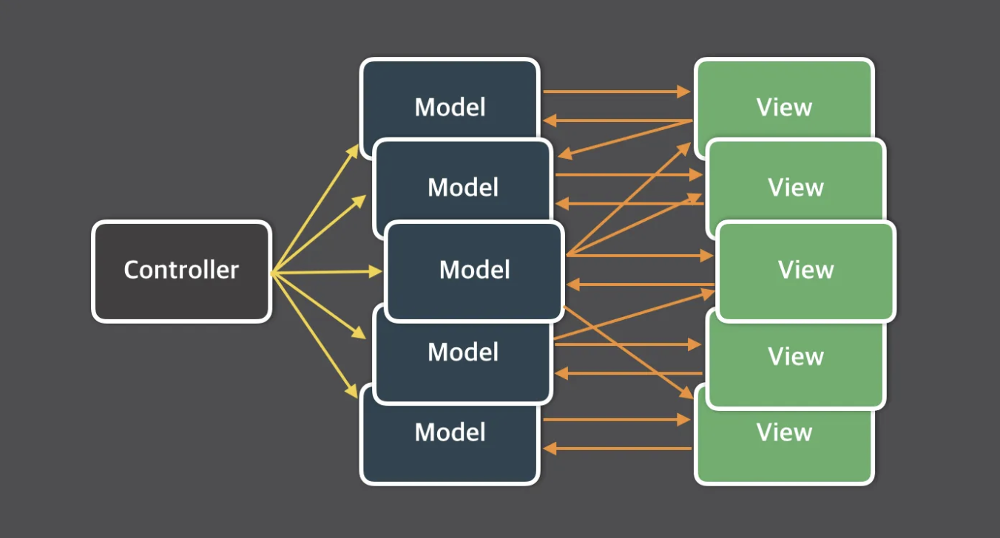
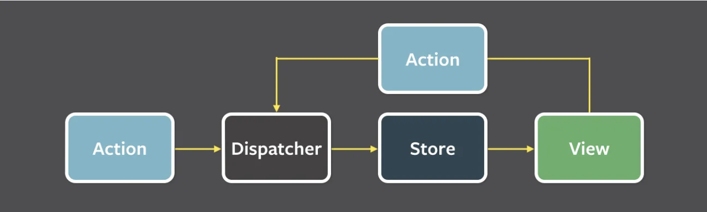

# 상태 관리는 왜 필요한가?

<br>

## 1. 상태 (State)

<br>

어떠한 의미를 지닌 `값`이며 애플리케이션의 시나리오에 따라 `지속적으로 변경될 수 있는 값`을 의미한다.

<br>

### 1) 종류

---

웹 애플리케이션에서 상태로 분류될 수 있는 것은 다음과 같다.

<br>

**UI**

- 상호 작용이 가능한 모든 요소의 현재 값
- 다크/라이트 모드, 각종 input, 알림창의 노출 여부 등

**URL**

- URL 내부에도 상태가 존재하며, 사용자의 라우팅에 따라 변경됨
- https://www.airbnb.co.kr/rooms/34113796?adults=2
    - roomId=34113796
    - adults=2

**폼(form)**

- 로딩 중인지(loading)
- 제출됐는지(submit)
- 접근이 불가능한지(disabled)
- 값이 유효한지(validation)

**서버에서 가져온 값**

- 클라이언트에서 API요청을 서버로부터 가져온 값도 상태로 볼 수 있음

<br>

### 2) 상태 관리 개요

---

단순히 `상태를 관리한다` 라고 하면 크게 어려운 개념은 아니다.

폼에서의 상태관리를 예시로 생각해 보자.

로딩/제출/접근유효성/값의유효성 각각에 대한 대처가 되어있으면 그것이 바로 `폼 상태 관리`이다.

<br>

하지만 애플리케이션 `전체적으로` 관리해야 할 상태가 있다고 가정해 보자.

그 상태에 따라 각각의 요소들은 그에 맞는 UI를 보여줘야 하는데, 여기서 고민점들이 생긴다.

- 상태는 어디에 둘 것인가? (전역 변수로? 별도의 클로저를 사용해서?)
- 상태의 유효한 범위는 어떻게 제한할 수 있는가?
- 자식 요소들은 상태의 변화를 어떻게 감지할 수 있는가?

<br>

이처럼 현대의 웹 애플리케이션 상태 관리란 고려해야 할 것이 많고 어렵다.

따라서 상태를 효율적으로 관리하고, 빠르게 적용할 수 있는 모델에 대해 고민이 본격적으로 시작된 것이다.

<br>

## 2. 리액트 상태 관리의 역사

<br>

다른 웹 개발 환경과 마찬가지로 리액트도 상태 관리에 대한 필요성이 존재했다.

하지만 리액트는 단순 라이브러리였기 때문에 그 이상의 기능(상태 관리 기능)을 제공하지 않았다.

따라서 개발자에 따라, 시간에 따라 많은 변화가 있었다.

<br>

### 1) Flux 패턴의 등장

---

2014년 리액트의 등장과 비슷한 시기에 `Flux 패턴`과 함께 이를 기반으로 한 라이브러리, `Flux`가 등장했다.

<br>

당시 웹 애플리케이션이 비대해지고 상태(데이터)도 많아짐에 따라 상태 변화를 추적하기 어려웠다.

기존 MVC 패턴에서 발생하는 이러한 문제의 원인을 `양방향 데이터 바인딩`이라고 인식했다.

- 뷰(HTML)가 모델(자바스크립트)을 변경할 수 있음
- 반대로 모델(자바스크립트)도 뷰(HTML)을 변경할 수 있음
- 코드 작성은 쉬울 수 있지만, 스케일이 커질수록 관리하기 어려움

<br>



출처 - https://haruair.github.io/flux/docs/overview.html

따라서 양방향이 아닌 `단방향 데이터 바인딩`을 제안했는데, 그것이 바로 `Flux 패턴`의 시작이다.

<br>



출처 - https://haruair.github.io/flux/docs/overview.html

Flux 패턴의 흐름은 `Action → Dispatcher → Model → View` 로 각 용어의 정의는 다음과 같다.

<br>

**액션 (Action)**

- 어떠한 작업을 처리할 `액션`과 그 액션 발생 시 함께 `포함시킬 데이터`를 의미함
- `액션 타입, 데이터`를 각각 정의해 `디스패처`로 전달

**디스패처 (Dispatcher)**

- 액션을 스토어에 보내는 역할
- `콜백 함수 형태`로 앞서 액션이 정의한 `타입과 데이터`를 `스토어`로 전달

**스토어 (Store)**

- `실제 상태`에 따른 값과 상태를 `변경`할 수 있는 메서드를 가지고 있음
- 액션 타입에 따라 어떻게 변경할지(어떤 메서드를 실행할지) 정의되어 있음

**뷰 (View)**

- 리액트 `컴포넌트`에 해당하는 부분
- 스토어에서 만든 데이터를 가져와 화면에 `렌더링`하는 역할
- 사용자의 입력이나 행위에 따라 상태를 업데이트 해야할 경우 → `액션` 호출

<br>

위와 같은 모습을 코드로 표현하면 다음과 같다.

```tsx
type StoreState = {
	const: number
}

// 액션: 어떤 종류가 있고, 어떤 데이터를 필요로 하는지 정의
type Action = {type: 'add'; payload:number}

function reducer(prevState: StoreState, action: Action){
	const {type: ActionType} = action
	
	if(ActionType === 'add'){
		return {
			count: prevState.count + action.payload,
		}
	}
	
	throw new Error(`Unexpected Action[%{ActionType}]`)
}

export default function App(){
	// 스토어: 현재 상태와 상태에 따른 값이 어떻게 변경되는지 정의 (useReducer가 스토어의 역할을 함)
	// 현재 상태 : state
	// 액션을 넘겨주는 함수 : dispatcher
	// 액션에 따라 실행할 함수 : reducer
	// 초기값 : {count:0}
	const [state, dispatcher] = useReducer(reducer, {count:0})
	
	function handleClick(){
		// 디스패처: 실행시킬 액션({type: 'add', payload: 1})을 스토어에 보냄
		dispatcher({type: 'add', payload: 1})
	}
	
	// 뷰: 화면에 보여지고, 사용자와 상호작용(plus버튼 클릭) 하는 역할
	return (
		<div>
			<h1>{state.count}</h1>
			<button onClick={handleClick}>plus</button>
		</div>
	)
} 
```

<br>

### 2) 리덕스(Redux)의 등장

---

`Flux` 구조를 구현하기 위해 만들어진 라이브러리 중 하나이다.

한 가지 특별한 점은 여기에 `Elm 아키텍처`를 도입했다는 것이다.

<br>

**Elm**

- 웹 페이지를 선언적으로 작성하기 위한 언어
- `Flux`와 마찬가지로 데이터 흐름을 `세가지`로 분류하고, 이를 `단방향`으로 강제함
    - model : 애플리케이션의 상태를 의미
    - view : 모델을 표현하는 HTML
    - update : 모델을 수정하는 방식을 의미

<br>

위와 같은 내용을 코드로 표현하면 다음과 같다.

**1) 액션 생성** : 타입과 데이터(payload) 정의

```jsx
// actions.js
export const addTodo = (text) => ({
  type: 'ADD_TODO',
  payload: { id: Date.now(), text }
});
```

**2) Reducer 작성** : 액션에 따라 상태를 어떻게 변화시킬지를 정의하는 함수

```jsx
// reducers.js
const initialState = { todos: [] };

export function todoReducer(state = initialState, action) {
	// 현재 상태와 액션을 인자로 받아서 새로운 상태를 반환
  switch (action.type) {
    case 'ADD_TODO':
      return { ...state, todos: [...state.todos, action.payload] };
    default:
      return state;
  }
}
```

**3) 스토어 생성** : 애플리케이션의 모든 상태를 포함하는 객체로, 상태를 읽고 업데이트할 수 있는 메서드를 제공

```jsx
// store.js
import { createStore } from 'redux';
import { todoReducer } from './reducers';

const store = createStore(todoReducer);
export default store;
```

**4) Provider로 전체 감싸기** : Redux 스토어를 애플리케이션의 모든 컴포넌트에서 접근할 수 있도록 만들어 줌

```jsx
// index.js
import React from 'react';
import ReactDOM from 'react-dom';
import { Provider } from 'react-redux';
import App from './App';
import store from './store';

ReactDOM.render(
  <Provider store={store}>
    <App />
  </Provider>,
  document.getElementById('root')
);
```

**5) 컴포넌트에서 Redux 사용** : useDispatch, useSelector 활용

```jsx
// App.js
import React, { useState } from 'react';
import { useSelector, useDispatch } from 'react-redux';
import { addTodo } from './actions';

function App() {
  const [text, setText] = useState('');
  
  // 상태에서 특정 부분을 추출하는 함수 (필요한 데이터를 효율적으로 가져올 수 있음)
  const todos = useSelector((state) => state.todos);
  // 액션을 스토어에 보내는 함수
  const dispatch = useDispatch();

  const handleAddTodo = () => {
    dispatch(addTodo(text));
    setText('');
  };

  return (
    <div>
      <input value={text} onChange={(e) => setText(e.target.value)} />
      <button onClick={handleAddTodo}>Add Todo</button>
      <ul>
        {todos.map((todo) => (
          <li key={todo.id}>{todo.text}</li>
        ))}
      </ul>
    </div>
  );
}

export default App;

```

<br>

**Redux의 동작 흐름**

1. 사용자가 애플리케이션에서 어떤 행동(예: 버튼 클릭)을 하여 Action 생성
2. Action이 Store로 dispatch 
3. Store는 Action과 현재 상태를 Reducer에 전달
4. Reducer는 Action의 타입에 따라 새로운 상태를 계산하여 반환
5. Store는 새로운 상태로 업데이트되고, 애플리케이션은 업데이트된 상태를 반영하여 다시 렌더링

<br>

**Redux의 장/단점**

- 장점: props를 깊이 전파해야 하는 이른바 `props 내려주기 문제 해결`
- 단점 : 액션, 리듀서, dispatcher, selector 등 하고자 하는 일에 비해 `보일러플레이트가 많음`

<br>

### 3) Context API와 useContext

---

`Redux`는 단순하게 상태를 참조하고 싶을 뿐인데, 준비해야 하는 보일러플레이트가 많다는 단점이 있었다.

따라서 리액트 팀은 16.3에서 `전역 상태를 하위 컴포넌트에 주입`할 수 있는 새로운 `Context API`를 발표했다.

<br>

**Context API 사용 방법**

**1) Context 생성:**  **`createContext`** 함수를 사용해 Context 생성

```jsx
import React, { createContext } from 'react';

// 기본값을 받고, Context 객체 반환
const MyContext = createContext(defaultValue);
```

**2) Context Provider 설정 :** `Context Provider`를 사용하여 하위 컴포넌트에 값을 주입

```jsx
import React, { createContext } from 'react';

const MyContext = createContext();

const MyProvider = ({ children }) => {
  const value = { someState: 'someValue' };

	// value라는 prop을 받음. 이 값은 하위 트리의 모든 컴포넌트에 제공 가능
  return (
    <MyContext.Provider value={value}>
      {children}
    </MyContext.Provider>
  );
};
```

**3) useContext로 Context 값 사용**

```jsx
import React, { useContext } from 'react';
import MyContext from './MyContext';

const MyComponent = () => {
	// Context 객체를 인자로 받아 해당 Context의 값을 반환
  const contextValue = useContext(MyContext);

  return <div>{contextValue.someState}</div>;
};
```

<br>

**주의❗️**

- Context API는 `상태 관리`가 아닌 `주입`을 도와주는 기능이다. (렌더링을 막아주는 기능이 없는 점 유의)
- Context 값이 변경되면 해당 Context를 구독하는 모든 컴포넌트가 리렌더링 된다. → 성능 문제 발생

<br>

### 4) 훅의 탄생, 그리고 React Query와 SWR

---

리액트 16.8에서 `함수 컴포넌트`에 사용할 수 있는 다양한 `훅 API`가 추가되었다.

이를 통해 클래스 컴포넌트보다 훨씬 간결한 방법으로 `state`를 재사용 가능하도록 만들 수 있었다.

이러한 훅의 등장으로, 이전에 볼 수 없던 방식의 상태 관리가 등장하는데 바로 `React Query`와 `SWR`이다.

두 라이브러리 모두 `HTTP 요청에 특화된 상태 관리 라이브러리`로 볼 수 있다.

<br>

**SWR (Stale-While-Revalidate) 주요 기능**

- **데이터 캐싱**: 한번 가져온 데이터는 캐시되어 재사용
- **자동 재검증**: 데이터가 오래되었을 때 자동으로 재검증
- **포커스 시 재검증**: 사용자가 브라우저 창을 다시 활성화할 때 데이터를 재검증
- **주기적 재검증**: 일정 시간 간격으로 데이터를 재검증

<br>

**SWR 예시 코드**

```jsx
import useSWR from 'swr';

const fetcher = (url) => fetch(url).then((res) => res.json());

function App() {
	// 첫번째 인수 : 조회할 API 주소
	// 두번째 인수 : 조회에 사용되는 fetch
  const { data, error } = useSWR('/api/data', fetcher);

  if (error) return <div>Error loading data</div>;
  if (!data) return <div>Loading...</div>;

  return (
	  <div>
		  <p>{JSON.stringify(data)}</p>
		</div>
	)
}

```

<br>

**React Query 주요 기능**

- **쿼리 캐싱**: 쿼리 데이터를 캐싱하여 재사용
- **백그라운드 데이터 업데이트**: 데이터를 백그라운드에서 자동으로 업데이트
- **자동 리패칭**: 데이터가 오래되었을 때 자동으로 다시 가져옴
- **폴링 및 실시간 데이터**: 일정 시간 간격으로 데이터를 자동으로 다시 가져옴
- **Mutation**: 서버에 데이터를 업데이트하고 로컬 캐시를 동기화

<br>

**React Query 사용 예제**

```jsx
import { useQuery } from 'react-query';

const fetchData = async () => {
  const res = await fetch('/api/data');
  return res.json();
};

function App() {
  const { data, error, isLoading } = useQuery('data', fetchData);

  if (isLoading) return <div>Loading...</div>;
  if (error) return <div>Error loading data</div>;

  return (
	  <div>
		  <p>{JSON.stringify(data)}</p>
		</div>
	)
}

```

<br>

### 5) Recoil, Zustand, Jotai, Valtio에 이르기까지

---

훅이라는 새로운 패러다임이 등장해, 훅을 통해 상태를 가져오거나 관리할 수 있는 다양한 라이브러리가 등장했다.

`Recoil`을 대표로 `Zustand`, `Jotai`, `Valtio` 가 새롭게 생긴 상태 관리 라이브러리이다.

`Redux` 와 다르게 훅을 활용해 전역 상태 관리 패러다임에서 벗어나 상태를 `지역적으로` 관리할 수 있게 했다.

<br>

**Recoil의 주요 개념**

**1) Atom**

- `상태의 최소 단위`를 나타내며, 컴포넌트가 구독할 수 있는 상태를 의미함
- Atom의 상태가 변경되면 이를 `구독`하고 있는 모든 컴포넌트가 다시 렌더링됨

**2) Selector**: 

- Selector는 `파생 상태`를 나타내며, `다른` Atom이나 Selector의 상태를 기반으로 계산된 값을 반환
- 비동기 데이터 페칭, 복잡한 계산 등에 활용 (부수 효과)

**3) RecoilRoot**

- Recoil 상태를 관리하기 위해 애플리케이션의 루트 컴포넌트를 감싸는 컴포넌트 (Context API의 Provider)

<br>

**Recoil 사용 방법**

**1) RecoilRoot로 애플리케이션 감싸기**

```jsx
// index.js
import React from 'react';
import ReactDOM from 'react-dom';
import { RecoilRoot } from 'recoil';
import App from './App';

ReactDOM.render(
  <RecoilRoot>
    <App />
  </RecoilRoot>,
  document.getElementById('root')
);
```

**2) Atom 생성** 

```jsx
// atoms.js
import { atom } from 'recoil';

// key: Atom을 구별하기 위한 고유 문자열
// default: Atom의 초기 상태 값
export const textState = atom({
  key: 'textState', 
  default: '',
});
```

**3) Atom 사용**

```jsx
// TextInput.js
import React from 'react';
import { useRecoilState } from 'recoil';
import { textState } from './atoms';

function TextInput() {
	// Atom의 상태를 읽고 업데이트하는 훅
  const [text, setText] = useRecoilState(textState);

  const onChange = (event) => {
    setText(event.target.value);
  };

  return (
    <div>
      <input type="text" value={text} onChange={onChange} />
      <br />
      Echo: {text}
    </div>
  );
}

export default TextInput;
```

**4) Selector 생성 및 사용**

```jsx
// selectors.js
import { selector } from 'recoil';
import { textState } from './atoms';

// key: Selector를 구별하기 위한 고유 문자열
// get: 다른 Atom이나 Selector의 상태를 가져와서 파생 상태를 계산
export const charCountState = selector({
  key: 'charCountState',
  get: ({ get }) => {
    const text = get(textState);
    return text.length;
  },
});
```

```jsx
// CharacterCount.js
import React from 'react';
import { useRecoilValue } from 'recoil';
import { charCountState } from './selectors';

function CharacterCount() {
	// Selector의 값을 읽는 훅
  const count = useRecoilValue(charCountState);

  return <>Character Count: {count}</>;
}

export default CharacterCount;
```