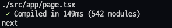
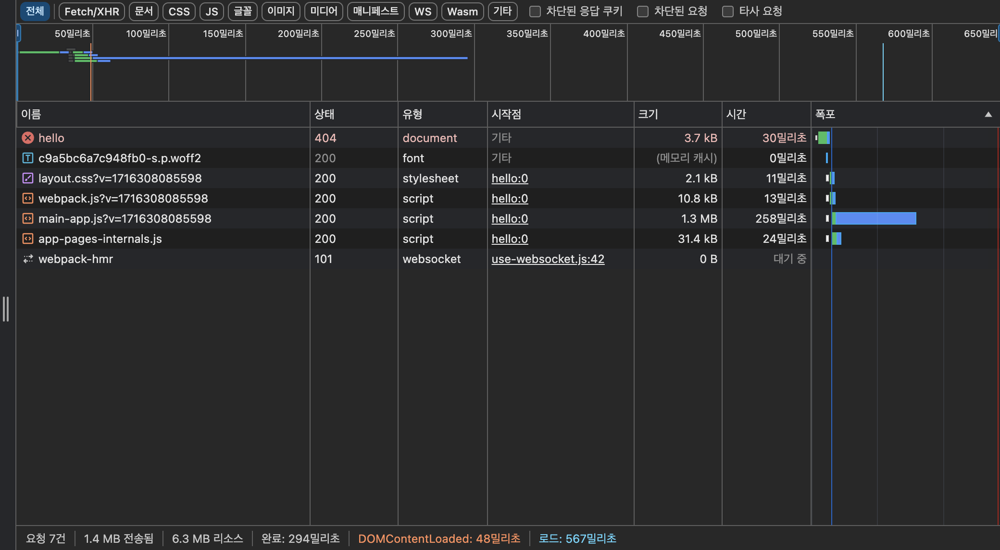
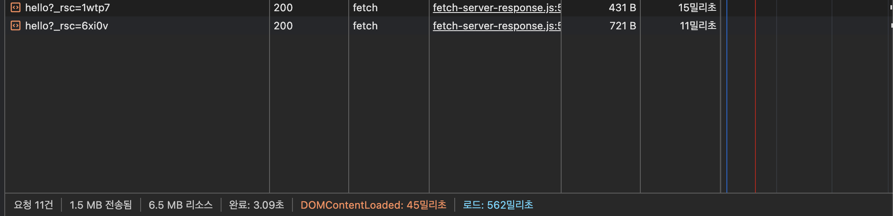

## 💡 4.3. Next.js 톺아보기

서버 사이드 렌더링 프레임워크로 가장 많은 인기를 얻고 있는 Next.js에 대해 살펴보자.

### 📌 4.3.1. Next.js란?

Next.js는 Vercel이라는 미국 스타트업에서 만든 풀스택 웹 애플리케이션을 구축하기 위한 리액트 기반 프레임워크로 현재까지는 v14까지 나왔다.

<br>

### 📌 4.3.2. Next.js 시작하기

**프로젝트 시작하기** <br>

`npx create-next-app@latest --ts`

<br>

Next.js 프로젝트를 만든 후 파일을 하나씩 열어서 어떤 구조로 작성됐는지 살펴보자.

`package.json` <br>
여기에는 프로젝트 구동에 필요한 모든 명령어 및 의존성이 포함돼 있으므로 프로젝트의 대략적인 모습을 확인하는데 매우 유용하다.

```json
{
  "name": "my-app",
  "version": "0.1.0",
  "private": true,
  "scripts": {
    "dev": "next dev",
    "build": "next build",
    "start": "next start",
    "lint": "next lint"
  },
  "dependencies": {
    "react": "^18",
    "react-dom": "^18",
    "next": "14.2.3"
  },
  "devDependencies": {
    "typescript": "^5",
    "@types/node": "^20",
    "@types/react": "^18",
    "@types/react-dom": "^18",
    "eslint": "^8",
    "eslint-config-next": "14.2.3"
  }
}
```

주요 의존성을 몇 가지 살펴보자.

- `next`: Next.js의 기반이 되는 패키지
- `eslint-config-next`: Next.js 기반 프로젝트에서 사용하도록 만들어진 ESLint 설정으로, 구글과 협업해 만든 핵심 웹 지표(core web vital)에 도움이 되는 규칙들이 내장돼 있다. Next.js 기반 프로젝트라면 꼭 사용하는 것을 추천하면 eslint-config-airbnb와 같은 기존에 사용하던 규칙이 있다면 이에 추가로 사용하는 것을 추천한다.

<br>

`next.config.js` <br>

이 파일은 Next.js 프로젝트의 **환경 설정**을 담당하며 Next.js를 자유자재로 다루려면 반드시 알아야 한다.

```javascript
/** @type {import('next').NextConfig} */
const nextConfig = {
  reactStrictMode: true,
  swcMinify: true,
};

export default nextConfig;
```

처음 프로젝트를 시작하면 nextConfig 안에 내용이 비어있으나 책을 기반으로 추가했다.

- `reactStrictMode` : 리액트의 엄격 모드와 관련된 옵션으로, 리액트 애플리케이션 내부에서 잠재적인 문제를 개발자에게 알리기 위한 도구이다. 특별한 이유가 없다면 켜두는 것이 도움이 된다.
- `swcMinify` : 바벨보다 빠르게 작동하며 바벨의 대안이라고 볼 수 있다. swc를 기반으로 **코드 최소화 작업**을 할 것인지의 여부를 설정하는 속성이다.
  - 이유 1. 자바스크립트 기반의 바벨과는 다르게 Rust라는 완전히 다른 언어로 작성했다는 점
  - Rust는 C/C++과 동등한 수준의 속도를 보여준다고 알려져 있다.
  - 또한 병렬로 작업을 처리한다는 점이 있다.

<br>

---

`pages/_app.tsx` / `app/pages.tsx`

13.4 이후 버전부터는 app라우터 방식으로 애플리케이션이 설치된다.
나는 14 이후 버전을 사용하였으므로 `app/pages.tsx` 파일이 루트에 존재한다.

이 파일은 파일 내부에서 export default로 내보낸 함수는 **애플리케이션의 전체 페이지의 시작점**이 된다.

<br>

이 파일에서 할 수 있는 내용은 다음과 같다.

- 에러 바운더리를 사용해 애플리케이션 전역에서 발생하는 에러 처리
- reset.css 같은 전역 CSS 선언
- 모든 페이지에 공통으로 사용 또는 제공해야 하는 데이터 제공 등

> ⭐️ 여기서 확인할 수 있는 서버 사이드 프레임워크의 특징 <br>
> 이 파일에 console.log를 추가해서 메시지를 기록한 후 페이지를 새로고침하면 브라우저의 콘솔창이 아닌 next.js를 실행한 터미널에 기록되는 것을 확인할 수 있다.
>  <br>
> 이후에 여기서 페이지를 전환하면 더 이상 서버에 로깅되지 않고 브라우저에 로깅되는 것을 확인할 수 있다. <br>
> → 이러한 사실로 미루어 봤을 때 **최초에는 서버 사이드 렌더링을, 이후에는 클라이언트에서 이 파일의 렌더링이 실행된다는 것을 짐작할 수 있다.**

<br>

---

`pages(app)/_documents.tsx`

create-next-app으로 생성했다면 해당 페이지가 존재하지 않을 것이다. <br>
이는 \_document.tsx가 없어도 실행에 지장이 없는 파일임으 의미한다.

그럼에도 \_document.tsx는 몇 가지 시나리오에서 유용한 도움을 준다. <br>
pages폴더 혹은 app폴더 내에 파일을 생성하고 다음과 같이 선언해보자.

```tsx
import { Html, Head, Main, NextScript } from "next/document";

export default function Document() {
  return (
    <Html>
      <Head />
      <body className="body">
        <Main />
        <NextScript />
      </body>
    </Html>
  );
}
```

pages.tsx(\_app.tsx)가 애플리케이션 페이지 전체를 초기화하는 곳이라면, **\_document.tsx는 애플리케이션의 HTML을 초기화하는 곳**이다.

> ❗️ pages.tsx(\_app.tsx)와의 차이점 <br>
>
> - `<html>`이나 `<body>`에 DOM속성을 추가하고 싶다면 \_document.tsx를 사용한다.
> - pages.tsx(\_app.tsx)는 렌더링이나 라우팅에 따라 서버나 클라이언트에서 실행할 수 있지만 **\_document.tsx는 무조건 서버에서 실행**된다.
>   - 따라서 onClick과 같은 이벤트 핸들러를 추가하는 것은 불가능하다.
>   - 이벤트를 추가하는 것은 클라이언트에서 실행되는 hydrate의 몫이기 때문이다.
> - Next.js에는 두 가지 `<head>`가 존재한다.
>   1. next/document에서 제공하는 head
>      - 오직 \_document.tsx에서만 사용할 수 있다.
>      - `<Head />` 내부에서 `<title />`을 사용할 수 없다.
>   2. next/head에서 기본적으로 제공하는 head
>      - 브라우저의 `<head />`와 동일한 역할을 한다.
>      - 페이지에서 사용할 수 있으며 SEO에 필요한 정보나 title 등을 담을 수 있다.
> - getServerSideProps, getStaticProps 등 서버에서 사용 가능한 데이터를 불러오기 함수는 \_document.tsx에서 사용 불가능하다.
> - CSS-in-JS의 스타일을 서버에서 모아 HTML로 제공하는 작업을 할 수 있다.

<br>

요약해보면,

- **pages.tsx(\_app.tsx)**는 Next.js를 초기화하는 파일로 Next.js 설정과 관련된 코드르 모아두는 곳이며, 경우에 따라 **서버와 클라이언트 모두**에서 렌더링될 수 있다.
- **\_document.tsx**는 Next.js로 만드는 웹사이트의 뼈대가 되는 HTML 설정과 관련된 코드를 추가하는 곳이며 **반드시 서버에서만 실행**된다.

<br>

---

`pages(app)/_error.tsx`

이 페이지도 create-next-app이 기본적으로 생성해주는 파일이 아니다. <br>
없어도 실행하는데에는 지장이 없다. <br>

```tsx
import { NextPageContext } from "next";

function Error({ statusCode }: { statusCode: number }) {
  return (
    <p>
      {statusCode ? `서버에서 ${statusCode}` : `클라이언트에서`} 에러가
      발생했습니다.
    </p>
  );
}

Error.getInitialProps = ({ res, err }: NextPageContext) => {
  const statusCode = res ? res.statusCode : err ? err.statusCode : "";
  return { statusCode };
};

export default Error;
```

이 에러 페이지는 <u>**클라이언트에서 발생하는 에러 또는 서버에서 발생하는 500 에러를 처리할 목적**</u>으로 만들어졌다.

Next.js 프로젝트 전역에서 발생하는 에러를 적절하게 처리하고 싶다면 이 페이지를 활용하면 된다. <br>
단, 개발 모드에서는 이 페이지에 방문할 수 없고 에러가 발생하면 Next.js가 제공하는 에러 팝업이 나타나게 된다.

<br>

---

`pages(app)/404.tsx`

이름에서도 알 수 있듯이 404 페이지를 정의할 수 있는 파일이다. <br>
만들지 않으면 Next.js에서 제공하는 기본 404 페이지를 볼 수 있고, 원하는 스타일의 404 페이지를 이곳에서 만들 수 있다.

```tsx
export default function My404Poage() {
  return <h1>페이지를 찾을 수 없습니다.</h1>;
}
```

<br>

---

`pages(app)/500.tsx`

서버에서 발생하는 에러를 핸들링하는 페이지다.
`_error.tsx` 파일과 `500.tsx` 파일 모두 있다면 **`500.tsx`가 우선적으로 실행**된다.

마찬가지로 둘 다 없다면 Next.js에서 기본적으로 제공하는 페이지를 볼 수 있다.

```tsx
export default function My500Poage() {
  return <h1>서버에서 에러가 발생했습니다.</h1>;
}
```

<br>

---

`pages(app)/index.tsx` / `app/layout.tsx`

지금부터 소개하는 페이지는 개발자가 _자유롭게_ 명칭을 지정해 만들 수 있는 페이지다. <br>
next14에서는 layout.tsx라는 이름으로 존재한다.

Next.js는 react-pages처럼 라우팅 구조는 다음과 같이 /pages 디렉터리를 기초로 구성되며, 각 페이지에 있는 export default로 내보낸 함수가 해당 페이지의 루트 컴포넌트가 된다.

**현재는 책의 내용을 기준으로 pages 방식을 기준으로 정리한 내용이다.** <br>
(app router 방식의 내용도 별도로 추가할 예정)

- /pages/index.tsx: 웹 사이트의 루트
- /pages/hello.tsx: /pages가 생략되고, 파일명이 주소가 된다. 즉, 여기서는 /hello이며 localhost://3000/hello로 접근할 수 있다.
- pages/hello/world.tsx: localhost:3000/hello/world로 접근 가능하다. 디렉터리의 깊이만큼 주소를 설정할 수 있다.
  - 한 가지 주의할 점은 hello/index.tsx와 hello.tsx는 모두 같은 주소를 바라본다.
- /pages/hello/[greeting].tsx: **[]의 의미는 여기에 어떤 문자도 올 수 있다**는 뜻이다. []안 변수에 사용자가 접속한 주소명이 오게 된다. `hello/1`, `hello/greeting` 모두 유효한 주소가 된다. 만약 이미 정의된 주소가 있다면 **미리 정의해 둔 주소를 우선**한다.
- /pages/hi/[...props].tsx: 전개연산자와 동일하다. /hi를 제외한 /hi 하위의 모든 주소가 여기로 온다. `localhost://hi/hello/world` 라는 주소가 있다고 하면 이때의 props라는 변수에 배열로 ['hello', 'world']가 들어오게 된다.
  - 단 여기서 주의할 점은 주소에 숫자를 입력해도 숫자로 형변환되지 않고 **문자열**로 들어온다는 것이다.
  - 전개 연산자로 선언한 모든 주소는 배열로 들어간다.

<br>

---

**💡 서버 라우팅과 클라이언트 라우팅의 차이**

Next.js는 서버 사이드 렌더링을 수행하지만 동시에 싱글 페이지 애플리케이션과 같이 클라이언트 라우팅 또한 수행한다.

- Next.js는 서버 사이드 렌더링을 비롯한 사전 렌더링을 지원한다.
  - 때문에 최초 페이지는 렌더링이 **서버에서** 수행된다.

`page.tsx`

```tsx
import type { NextPage } from "next";
import Link from "next/link";

const Home: NextPage = () => {
  return (
    <ul>
      <li>
        <a href="/hello">A태그로 이동</a>
      </li>
      <li>
        <Link prefetch={false} href="/hello">
          next/link로 이동
        </Link>
      </li>
    </ul>
  );
};

export default Home;
```

- `next/link`: Next.js에서 제공하는 라우팅 컴포넌트로 a태그와 비슷한 동작을 한다.

언뜻 보기에 두 링크는 완전 동일하게 작동하는 것처럼 보인다. <br>
그러나 네트워크 탭에서 모든 활동을 지우고 각 링크를 클릭해 이동해보자.

**<a태그로 이동했을 경우>**



→ 모든 리소스를 처음부터 새로 불러온다.
또한 렌더링이 어디서 일어났는지 판단을 위한 콘솔도 서버와 클라이언트에 각각 기록된다. <br>
**즉, 서버에서 렌더링을 수행하고, 클라이언트에서 hydrate하는 과정에서 한 번 더 실행됐다는 것을 알 수 있다.**

<br>

**<Link 태그로 이동했을 경우>**



→ 이 경우에는 모든 리소스를 다시 받는 게 아니라 hello페이지 이동에 필요한 내용만 받는다.

next/link로 이동하는 경우 서버 사이드 렌더링이 아닌, **클라이언트에서 필요한 자바스크립트만 불러온 뒤 라우팅하는 클라이언트 라우팅/렌더링 방식으로 작동하는 것**을 확인할 수 있다.

Next.js는 서버 사이드 렌더링의 장점, 즉 사용자가 <u>**빠르게 볼 수 있는 최초 페이지를 제공**</u>한다는 점과 싱글 페이지 애플리케이션의 장점인 <u>**자연스러운 라우팅**</u> 두 가지 장점을 모두 살리기 위해 이처럼 작동한다.

> ⭐️ 결론 <br>
>
> - a태그 대신 **Link태그**를 사용하자!
> - window.location.push 대신 **router.push**를 사용하자!

<br>

---

> **💡 페이지에서 getServerSideProps를 제거하면 어떻게 될까?** <br>
> → getServerSideProps가 없는 채로 빌들르 하게 되면 빌드 크기도 줄어들며 서버 사이드 렌더링이 필요없는 정적인 페이지로 분류된다.
>
> 즉, getServerSideProps가 없으면 서버에서 실행하지 않아도 되는 페이지로 처리하고 빌드 시점에서 미리 트리쉐이킹을 거친다.
>
> 이처럼 Next.js는 서버 사이드 렌더링 프레임워크지만 모든 작업이 서버에서 일어나는 것은 아니라는 것을 명심해야 한다.

<br>

---

`pages/api/hello.ts` / `app/api/hello.ts`

이 api 폴더는 서버의 API를 정의하는 폴더이다. <br>
즉, `pages/api/hello.ts` / `app/api/hello.ts` 는 `/api/hello`로 호출할 수 있으며, 이 주소는 HTML을 요청을 하는 게 아니라 단순히 <u>**서버 요청**</u>을 주고받게 된다.

```typescript
import type { NextApiRequest, NextApiResponse } from "next";

type Data = {
  name: string;
};

const handler = (req: NextApiRequest, res: NextApiResponse) => {
  res.status(200).json({ name: "Jhon Doe" });
};
```

express와 같이 Node.js 기반의 서버 프레임워크를 사용해 본 경험이 있다면 쉽게 사용할 수 있을 것이다. <br>

여기에 있는 코드는 당연히 오직 서버에서만 실행된다. <br>
따라서 window나 document와 같이 브라우저에서만 접근할 수 있는 코드를 작성하면 당연히 문제가 발생한다.

주로 서버에서 내려주는 데이터를 조합해 BFF(backend-for-frontend) 형태로 활용하거나, 완전한 풀스택 애플리케이션을 구축하고 싶을 때, 혹은 CORS 문제를 우회하기 위해 사용될 수 있다.

<br>

---

### 📌 4.3.3. Data Fetching

**⚙️ getStaticPaths와 getStaticProps**

이 두 함수는 어떠한 페이지를 CMS(Contents Management System)나 블로그, 게시판과 같이 사용자와 관계없이 정적으로 결정된 페이지를 보여주고자 할 때 사용되는 함수다.

getStaticProps와 getStaticPaths는 **반드시 함께 있어야 사용할 수 있다!**

예를 들어, /pages/post/[id]와 같은 페이지가 있고, 해당 페이지에 다음과 같이 두 함수를 사용했다고 가정해보자.

```tsx
import { GetStaticPaths, GetStaticProps } from "next";

export const getStaticPaths: GetStaticPaths = async () => {
  return {
    // paths를 배열로 반환
    // params를 키로 하는 함수에 적절한 값을 배열로 넘겨 접근 가능한 페이지를 정의
    // 따라서 /post/1 과 /post/2만 접근 가능함을 의미
    // 이외의 페이지는 404를 반환한다.
    paths: [{ params: { id: "1" } }, { params: { id: "2" } }],
    fallback: false,
  };
};

export const getStaticProps: GetStaticProps = async ({ params }) => {
  const { id } = params;

  const post = await fetchPost(id);

  return {
    props: { post },
  };
};

export default function Post({ post }: { post: Post }) {
  // post로 페이지 렌더링
}
```

- getStaticPaths
  - /pages/post/[id]가 접근 가능한 주소를 정의하는 함수
- getStaticProps
  - 정의한 페이지를 기준으로 해당 페이지로 요청이 왔을 때 제공할 props를 반환하는 함수
  - 예제에서는 id가 1, 2로 제한돼 있기 때문에 fetchPost(1), fetchPost(2)를 기준으로 각각 함수의 응답 결과를 변수로 가져와 props의 {post}로 반환한다.
- Post
  - getStaticProps에서 반환받은 결과(post)를 바탕으로 페이지를 렌더링하는 역할

→ 이렇게 두 함수를 사용하면 빌드 시점에 미리 데이터를 불러온 다음에 정적인 HTML 페이지를 만들 수 있다.

실제로 빌드해보면 []안의 변수의 값에 따라 가능한 모든 조합을 빌드 시점에 불러와 페이지로 렌더링한다. <br>
이렇게 접근할 수 있는 페이지를 모두 빌드해 두고 배포하면 사용자는 굳이 페이지가 렌더링되는 것을 **기다릴 필요 없이 이미 완성돼 있는 페이지를 받기**만 하면 되므로 **매우 빠르다!**

<br>

> ❗️fallback 이란? <br>
> → getStaticPaths의 fallback옵션은 미리 빌드해야 할 페이지가 너무 많은 경우 사용 가능하다. <br> > **paths에 미리 빌드해 둘 몇 개의 페이지만 리스트로 반환하고 true나 "blocking"으로 값을 선언**할 수 있다. <br>
>
> 이렇게 하고 `next build`를 실행하면 미리 반환해 둔 paths에 기재돼 있는 페이지만 미리 빌드하고 나머지의 경우 다음과 같이 작동한다.
>
> - "blocking" : 별도의 로딩과 같은 처리 없이 단순히 **빌드가 완료될 때까지 사용자를 기다리게 하는** 옵션. 대기하다가 렌더링이 완료되면 페이지를 제공한다.
> - true : 사용자가 미리 빌드하지 않은 페이지에 접근하면 **빌드되기 전까지는 fallback 컴포넌트를 보여**주고, 빌드가 완료된 이후 해당 페이지를 보여주는 옵션.

<br>

**fallback: true**

```typescript
function Post({ post }: { post: Post }) {
  const router = useRouter();

  // 아직 빌드되지 않은 페이지에 오면 사용자에게 보여줄
  // 로딩 컴포넌트를 정의
  if (router.isFallback) {
    return <div>Loading...</div>;
  }

  // post 렌더링
}
```

<br>

이처럼 getStaticPaths와 getStaticProps는 정적인 데이터만 제공하면 되는 사이트와 같이 단순히 콘텐츠를 빠르게 제공하기만 하는 경우에 매우 유용하다!

또한, 여기서 제공해야 할 페이지의 수에 따라 페이지를 빌드 시점에 미리 준비해 두거나 혹은 fallback을 사용해 사용자의 요청이 있을 때만 빌드하는 등의 최적화를 추가할 수도 있다!

<br>

---

<br>

**⚙️ getServerSideProps**

앞의 두 함수가 정적인 페이지 제공을 위해 사용된다면, **getServerSideProps는 서버에서 실행되는 함수이며 해당 함수가 있다면 무조건 페이지 진입 전에 이 함수를 실행**한다.

이 함수는 응답값에 따라 페이지의 루트 컴포넌트에 props를 반환할수도/다른 페이지로 리다이렉트시킬 수도 있다.

이 함수가 있으면 **Next.js는 꼭 서버에서 실행해야 하는 페이지로 분류**해 빌드 시에도 서버용 자바스크립트 파일을 별도로 만든다.

```typescript
import type { GetServerSideProps } from "next";

export default function Post({ post }: { post: Post }) {
  // 렌더링
}

export const getServerSideProps: GetServerSideProps = async (context) => {
  const {
    query: { id = "" },
  } = context;
  const post = await fetchPost(id.toString());
  return {
    props: { post },
  };
};
```

`context.query.id`를 사용하면 `/post/[id]`와 같은 경로에 있는 id 값에 접근할 수 있다. 이 값을 이용해 props를 제공하면 페이지의 Post 컴포넌트에 해당 값을 제공해 이 값을 기준으로 렌더링을 수행할 수 있다.

> ⭐️ 리액트의 서버 사이드 렌더링을 하는 작동 <br>
>
> 1. 서버에서 fetch 등으로 렌더링에 필요한 정보를 가져온다.
> 2. 1번에서 가져온 정보를 기반으로 HTML을 완성한다.
> 3. 2번의 정보를 클라이언트(브라우저)에 제공한다.
> 4. 3번의 정보를 바탕으로 클라이언트에서 hydrate 작업을 한다. 이 작업은 DOM에 리액트 라이프사이클과 이벤트 핸들러를 추가하는 작업이다.
> 5. 4번 작업인 hydrate로 만든 리액트 컴포넌트 트리와 서버에서 만든 HTML이 다르다면 불일치 에러를 뱉는다 (suppressHydrationWarning)
> 6. 5번 작업도 1번과 마찬가지로 fetch등을 이용해 정보를 가져와야 한다.

즉, Next.js의 **서버 사이드 렌더링 과정은 getServerSideProps의 실행과 함께 이루어지며**, 이 정보를 기반으로 페이지를 렌더링하는 과정이 바로 서버 사이드 렌더링이다.

1번과 6번 작업 사이에 fetch 시점에 따라 결과물의 불일치가 발생할 수 있으므로 1번에서 가져온 정보를 HTML에 script 형태로 내려주는 것이다.

이 작업을 거치면 1번의 작업을 6번에서 반복하지 않아도 되어 불필요한 요청을 막을 수 있을 뿐더러 시점 차이로 인한 결과물의 차이도 막을 수 있다.

> ❗️getServerSideProps로 내려주는 값은 json으로 제한된다. <br>
> → props의 결과를 HTML에 정적으로 작성해서 내려주기 때문에 JSON으로 직렬활할 수 없는 값, 즉 class나 Date 등은 props로 제공할 수 없다. <br>
> getServerSideProps에서는 반드시 JSON.stringfy로 직렬화할 수 있는 값만 제공해야 하고, 값에 대해 가공이 필요하다면 실제 페이지나 컴포넌트에서 하는 것이 옳다. <br>
> 만약 JSON으로 변환할 수 없는 값이 props로 제공된다면 에러가 발생하게 된다.

<br>

> ⭐️ getServerSideProps는 무조건 서버에서만 실행된다
>
> - window.document와 같이 브라우저에서만 접근할 수 있는 객체에는 접근할 수 없다.
> - API 호출 시 /api/some/path와 같이 protocol과 domain 없이 fetch 요청을 할 수 없다. 브라우저와 다르게 서버는 자신의 호스트를 유출할 수 없기 때문이다. **반드시 완전한 주소를 제공해야 fetch가 가능**하다.
> - 여기에서 에러가 발생한다면 500.tsx와 같이 미리 정의해 둔 에러 페이지로 리다이렉트된다.

<br>

> ⭐️ **<u>항상 getServerSideProps는 서버에서 실행되는 함수라는 사실을 기억하자.</u>**
>
> - 서버 사이드 렌더링은 루트 컴포넌트로부터 시작해 모든 컴포넌트를 실행해 완성하므로 **클라이언트에서만 실행 가능한 변수, 함수, 라이브러리 등은 서버에서 실행되지 않도록 별도로 처리**해야 한다.
> - 또한 이 함수는 사용자가 매 페이지를 호출할 때마다 실행되고, 이 실행이 끝나기 전까지는 사용자에게 어떤 HTML도 보여줄 수 없다.
> - 따라서 getServerSideProps 내부에서 실행하는 내용은 **최대한 간결**하게 작성하기 위해 꼭 **최초에 보여줘야 하는 데이터가 아니라면** getServerSideProps보다는 **클라인트에서 호출하는 것이 더 유리**하다.

<br>

마지막으로 getServerSideProps에서 어떤 조건에 따라 다른 페이지로 보내고 싶다면 `redirect`를 사용할 수 있다.

```typescript
import type { GetServerSideProps } from "next";

export const getServerSideProps: GetServerSideProps = async (context) => {
  const {
    query: { id = "" },
  } = context;
  const post = await fetchPost(id.toString());

  // redirect
  if (!post) {
    redirect: {
      destination: "/404";
    }
  }

  return {
    props: { post },
  };
};
```

이렇게 redirect 처리를 해주면 클라이언트에서 리다이렉트하는 것에 비해 훨씬 더 자연스럽다. <br>
클라이언트에서는 아무리 리다이렉트를 초기화해도 자바스크립트가 어느 정도 로딩된 이후에 실행할 수밖에 없다. <br>
하지만 getServerSideProps를 사용하면 **조건에 따라 사용자에게 해당 페이지를 보여주기도 전에 원하는 페이지로 보내버릴 수 있어 사용자에게 훨씬 더 자연스럽게 보여줄 수 있다.**

---

<br>

---

**⚙️ getInitialProps**

getInitialProps는 getStaticProps나 getServerSideProps가 나오기 전에 사용할 수 있었던 유일한 페이지 데이터 불러오기 수단이었다. <br>
대부분의 경우에는 getStaticProps나 getServerSideProps를 사용하는 것을 권장하며, getInitialProps는 **제한적인 예시**에서만 사용된다.

그러나 과거에 작성된 Next.js 코드에는 getInitialProps만 존재하고 일부 페이지에서는 getInitialProps밖에 사용할 수 없으므로 반드시 알고 있어야 한다.

```javascript
import Link from "next/link";

export default function Todo({ todo }) {
  return (
    <>
      <h1>{todo.title}</h1>
      <ul>
        <li>
          <Link href="/todo/1">1번</Link>
        </li>
        <li>
          <Link href="/todo/2">2번</Link>
        </li>
        <li>
          <Link href="/todo/3">3번</Link>
        </li>
      </ul>
    </>
  );
}

Todo.getInitialProps = async (ctx) => {
  const {
    query: { id = "" },
  } = ctx;
  const res = await fetch(`https://jsonplaceholder.typicode.com/todos/${id}`);
  const result = await res.json();
  console.log("fetch Complete!");
  return { todo: result };
};
```

- 페이지의 루트 함수에 정적 메서드로 추가한다.
- props객체를 반환하는 것이 아니라 바로 객체를 반환한다.

<br>

예제를 작성해 페이지를 최초 진입했을 때와 Link 태그를 사용해 클라이언트 라우팅을 수행했을 때 console.log가 어디서 실행되는 지 확인해보자.

- 최초 진입 시에는 서버에서 실행된다.
- 그 이후 클라이언트에서 라우팅을 수행했다면 클라이언트에서 실행된다.

→ 따라서 getInitialProps에 코드를 작성할 때는 반드시 주의를 기울여야 한다. 여기에 있는 코드는 때에 따라 서버와 클라이언트 모두에서 실행될 수 있으므로 이러한 특징을 감안해 코드를 작성해야 한다.

**💡 해당 메서드가 어디서 실행되는지 알고싶다면?**

```javascript
Todo.getInitialProps = async (context) => {
  const isServer = context.req;
  console.log(`${isServer ? "서버" : "클라이언트"}에서 실행되었습니다.`);
};
```

이 밖에도 context 객체에는 다양한 값이 존재한다.

- pathname: 현재 경로명. 실제 경로가 아닌 **페이지상 경로**.
  - ex. /todo/[id]
- asPath: 브라우저에 표시되는 **실제 경로**. 사용자에게 표시되는 주소가 보인다.
  - ex. /todo/1
- query: url에 존재하는 쿼리. 여기에는 pathname에 있는 [id] 값도 포함된다. 즉, 예제에서는 쿼리 파라미터가 없어도 기본적으로 {id; '1'}과 같은 값이 제공된다.
  - /todo/2?foo=bar&id=3 처럼 쿼리 문자열이 추가돼 있다면
  - {foo: 'bar', id: '2'} 객체가 반환된다.
  - [id]는 페이지의 query를 우선시하므로 반드시 다른 값으로 변경해야 한다.
- req: Node.js에서 제공하는 http request 객체
- res: Node.js에서 제공하는 http response 객체

<br>
<br>

getInitialProps는 다른 데이터 가져오기에 비해 사용하기도 까다롭고 여러 가지 주의할 점이 있으므로 **가급적이면 getStaticProps, getServerSideProps를 사용하는 편이 좋다.** <br>
getInitialProps는 Next.js 특성상 **사용이 제한돼 있는 페이지에서만 사용**하는 것이 좋다.

<br>

---

<br>

### 📌 4.3.4. 스타일 적용하기

**🖍️ 전역 스타일**

CSS Reset이라고 불리는 브라우저에 기본적으로 제공되고 있는 스타일을 초기화하는 등 애플리케이션 전체에 공통으로 적용하고 싶은 스타일이 있다면 \_app.tsx를 활용하면 된다.

여기에 필요한 스타일을 직접 import로 불러오면 애플리케이션 전체에 영향을 미칠 수 있다.

글로벌 스타일은 다른 페이지나 컴포넌트와 충돌할 수 있으므로 반드시 \_app.tsx에서만 제한적으로 작성해야 한다.

<br>

---

<br>

**🖍️ 컴포넌트 레벨 CSS**

Next.js에서는 **컴포넌트 레벨의 CSS**를 추가할 수 있다. <br>
`[name].module.css`와 같은 명명 규칙만 준수하면 되며, 이 컴포넌트 레벨 CSS는 다른 컴포넌트의 클래스명과 겹쳐서 스타일에 충돌이 일어나지 않도록 고유한 클래스명을 제공한다.

```css
.alert {
  color: red;
  font-size: 16px;
}
```

이 button.module.css를 컴포넌트에서 다음과 같이 사용할 수 있다

```jsx
import styled from "./Button.module.css";

export function Button() {
  return (
    <button type="button" className={styles.alert}>
      경고!
    </button>
  );
}
```

위처럼 스타일을 입히면 HTML에서 다음과 같은 결과를 확인할 수 있다.

```html
<head>
  <styles> .Button_alert__62TGU{ color: red; font-size: 16px; } </styles>
</head>
<button type="button" class="Button_alert__62TGU">경고!</button>
```

button에 alert 클래스를 선언해 스타일을 입혔지만 실제 클래스는 Button_alert\_\_62TGU같이 조금 다른 것을 볼 수 있다. <br>
이는 앞서 언급한 컴포넌트별 **스타일 충돌을 방지**하기 위한 **Next.js의 최적화**가 잘 작동하고 있는 것임을 확인할 수 있다.

<br>

---

<br>

**🖍️ SCSS와 SASS**

sass와 scss도 css를 사용했을 때와 마찬가지로 동일한 방식으로 사용할 수 있다.<br>
sass패키지를 설치하면 별도 설정 없이 바로 동일하게 스타일을 사용할 수 있다. <br>

scss에서 제공하는 variable을 컴포넌트에서 사용하고 싶다면 export 문법을 사용하면 된다.

```jsx
$primary: blue;

:export {
  primary: $primary;
}


import styles from './Button.module.scss';

export function Button(){
  return(
    <span style={{color: styles.primary}}>
      안녕하세요
    </span>
  )
}
```

<br>

---

<br>

**🖍️ CSS-in-JS**

최근에는 자바스크립트 내부에 스타일시트를 삽입하는 CSS-in-JS 방식의 스타일링이 각광받고 있다.<br>
코드 작성의 편의성 이외에 실제로 성능 이점을 가지고 있는지는 논쟁거리로 남아있지만 개**발에게 직관적이고 편리하게 느껴질 것이다.**

여기서는 styled-components를 주로 다룬다.<br>
이를 사용하기 위해서는 다음과 같은 코드가 필요하다. <br>
\_documents.tsx가 없다면 해당 파일을 생성하고 아래처럼 작성해보자.

```tsx
import Document, {
  Html,
  Head,
  Main,
  NextScript,
  DocumentContext,
  DocumentInitialProps,
} from "next/document";
import { ServerStyleSheet } from "styled-components";

export default function MyDocument() {
  return (
    <Html lang="ko">
      <Head />
      <body>
        <Main />
        <NextScript />
      </body>
    </Html>
  );
}

MyDocument.getInitialProps = async (
  ctx: DocumentContext
): Promise<DocumentInitialProps> => {
  const sheet = new ServerStyleSheet();
  const originalRenderPage = ctx.renderPage;

  try {
    ctx.renderPage = () =>
      originalRenderPage({
        enhanceApp: (App) => (props) => sheet.collectStyles(<App {...props} />),
      });

    const initialProps = await Document.getInitialProps(ctx);

    return {
      ...initialProps,
      styles: (
        <>
          {initialProps.styles}
          {sheet.getStyleElement()}
        </>
      ),
    };
  } finally {
    sheet.seal();
  }
};
```

이렇게 봐서는 이해가 안되는 코드가 많다. 이 파일은 문서를 초기화하기 위한 Next.js의 특별한 페이지이다. <br>
여기에 서버와 클라이언트 모두에서 작동하는 getInitialProps를 사용해 무언가 처리하는 거 같다.

- ServerStyleSheet: styled-components의 스타일을 **서버에서 초기화해 사용되는 클래스**. 이 클래스를 인스턴스로 초기화하면 서버에서 styled-components가 작동하기 위한 다양한 기능을 가지고 있다.
- originalRenderPage: ctx.renderPage를 담아두고 있다. 즉, 기존의 ctx.renderPage가 하는 작업에 추가적으로 styled-components 관련 작업을 하기 위해 별도 변수로 분리했다.
- ctx.renderPage: 기존에 해야 하는 작업과 함께 enhanceApp, 즉 App을 렌더링할 때 추가로 수행하고 싶은 작업을 정의했다.
  - 여기서 추가로 하는 작업이 `sheet.collectStyles(<App {...props} />)`
  - StyleSheetManager라고 불리는 ContextAPI로 감싸는 역할
  - 기존의 <App /> 위에 styled-components의 ContextAPI로 한 번 더 감싼 형태인 것이다.
- `const initialProps = await Document.getInitialProps(ctx)` : 기존의 \_documents.tsx가 렌더링을 수행할 때 필요한 getInitialProps를 생성하는 작업을 한다.
- 마지막 반환 문구: 기존에 기본적으로 내려주는 props에 추가적으로 styled-components가 모아둔 자바스크립트 파일 내 스타일을 반환한다. 이렇게 되면 서버 사이드 렌더링 시에 최초로 \_document 렌더링될 때, styled-components에서 수집한 스타일도 함께 내려줄 수 있다.

<u>**→ 요약하면 리액트 트리 내부에서 사용하고 있는 styled-components의 스타일을 모두 모은 다음, 이 각각의 스타일에 유니크한 클래스명을 부여해 스타일이 충돌하지 않게 클래스명과 스타일을 정리해 이를 \_document.tsx가 서버에서 렌더링할 때 React.Context형식으로 제공하는 것이다.**</u>

이렇게 모아서 서버에서 렌더링을 한 후 한꺼번에 제공해야 올바른 스타일을 적용할 수 있다.

**따라서 이런 초기화 과정이 매우 중요하다 !!**

> ❗️만약 바벨 대신 swc를 사용한다면 ? <br>
> next.config.js에 다음과 같이 compiler.styledComponents를 추가하면 된다.

```js
/** @type {import('next').NextConfig} */
const nextConfig = {
  reactStrictMode: true,
  swcMinify: true,
  compiler: {
    styledComponents: true,
  },
};

export default nextConfig;
```

→ swc를 사용하면 빠른 빌드의 이점을 누릴 수 있다는 점이 좋다!

<br>

---

<br>

### 📌 4.3.6. next.config.js 살펴보기

위에서 알아봤듯이 next.config.js는 Next.js 실행에 필요한 설정을 추가할 수 있는 파일이다. <br>

Next.js 실행과 사용자화에 필요한 다양한 설정을 추가할 수 있으므로 어떤 설정이 가능한지 직접 코드를 통해 확인해 보는 것이 좋다.

실무에서 자주 사용되는 설정을 살펴보자

- `basePath`: 기본적으로 애플리케이션을 실행하면 호스트 아래 /에 애플리케이션이 제공될 것이다. 이 basePath 속성에 'docs'와 같이 문자열을 추가하면 서비스의 시작점이 `localhost:3000/docs` 이렇게 된다.
  - 일종의 url을 위한 접두사라 볼 수 있다.
  - 여기에 값을 추가했다 하더라도 라우팅이나 Link에 basePath를 추가할 필요는 없다.
  - basePath가 있다면 클라이언트 렌더링을 트리거하는 모든 주소에 알아서 basePath가 붙은 채로 렌더링 및 작동이 일어난다.
  - `<Link href="/about" />` 이라면 렌더링 시에는 `/docs/about`으로 렌더링된다.
  - 다만, 이것 또한 **Next.js에서 제공하는 기능**으로 a태그를 직접 사용하거나 window.location.push 등으로 라우팅을 수행하면 반드시 basePath를 붙여야 한다.
- `swcMinify`: swc를 이용해 코드를 압축할지를 나타낸다. 기본값은 true이지만 실험적인 기능이라 걱정된다면 false로 끌 수 있다.
  - 13버전부터는 기본값이 true이므로 별도 설정을 하지 않는다면 swc로 코드를 압축한다.
- `poweredByHeader`: Next.js는 응답 헤더에 X-Power-by: Next.js 정보를 제공한다. false를 선언하면 이 정보가 사라진다.
  - 기본적으로 보안 관련 솔루션에서는 powered-by 헤더를 취약점으로 분류하므로 false로 설정하는 것이 좋다.
- `redirects`: 특정 주소를 다른 주소로 보내고 싶을 때 사용된다. 정규식도 사용가능하므로 다양한 방식으로 응용 가능하다.
- `reactStrictMode`: 리액트에서 제공하는 엄격 모드 설정 여부. 기본값은 false이지만 true로 설정해 다가올 리액트 업데이트에 미리 대비하는 것이 좋다.
- `assetPrefix`: 만약 next에서 빌드된 결과물을 동일한 호스트가 아닌 다른 CDN 등에 업로드하고자 한다면 이 옵션에 해당 CDN 주소를 명시하면 된다.
  - 이 설정이 활성화되면 static 리소스들은 해당 주소에 있다고 가정하고 해당 주소로 요청하게 된다.
  - 즉, 정적인 리소스들을 별도 CDN에 업로드하고 싶다면 이 기능을 활용하면 된다.
