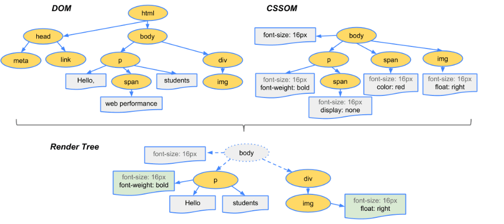
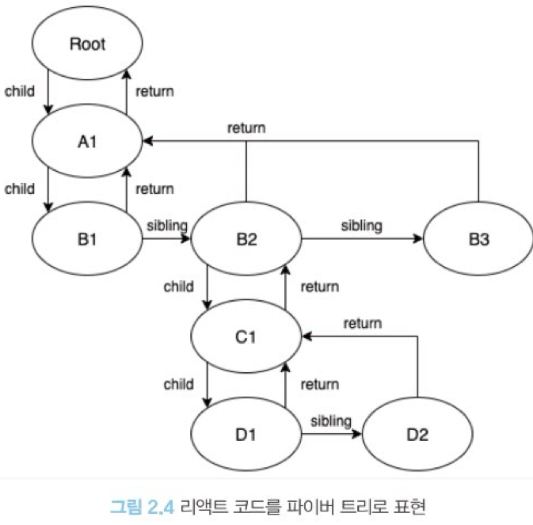

# 2.2 가상 DOM과 리액트 파이버

리액트의 대표적인 특징은 실제 DOM이 아니라 가상 DOM을 운영하는것

## 2.2.1 DOM과 브라우저 렌더링 과정

`DOM(Document Object Model)`은 웹페이지에 대한 인터페이스로 브라우저가 웹페이지의 콘텐츠와 구조를 어떻게 보여줄지에 대한 정보를 담고 있다.

브라우저가 웹사이트 접근 요청을 받고 화면을 그리는 과정

1. 브라우저가 사용자가 요청한 주소를 방문해 HTML 파일을 다운로드한다.
2. 브라우저의 렌더링 엔진은 HTML을 파싱해 DOM 노드로 구성된 트리(DOM)를 만든다.
3. 2번 과정에서 CSS 파일을 만나면 해당 CSS 파일도 다운로드한다.
4. 브라우저의 렌더링 엔진은 이 CSS도 파싱해 CSS 노드로 구성된 트리(CSSOM)를 만든다.
5. 브라우저는 2번에서 만든 DOM 노드를 순회하는데, 여기서 모든 노드를 방문하는 것이 아니고 사용자 눈에 보이는 노드만 방문한다. 즉. display: none과 같이 사용자 화면에 보이지 않는 요소는 방문해 작업하지 않는다. 이는 트리를 분석하는 과정을 조금이라도 빠르게 하기 위해서다.
6. 5번에서 제외된, 눈에 보이는 노드를 대상으로 해당 노드에 대한 CSSOM 정보를 찾고 여기서 발견한 CSS 스타일 정보를 이 노드에 적용한다. 이 DOM 노드에 CSS를 적용하는 과정은 크게 두 가지로 나눌 수 있다.

- 레이아웃(layout, reflow): 각 노드가 브라우저 화면의 어느 좌표에 정확히 나타나야 하는지 계산하는 과정. 이 레이아웃 과정을 거치면 반드시 페인팅 과정도 거치게 된다.
- 페인팅(painting): 레이아웃 단계를 거친 노드에 색과 같은 실제 유효한 모습을 그리는 과정.

<br/>



```html
<!--코드를 통해 알아보기 -->
#text {
background-color: red;
color: white;
}
<! DOCTYPE html>
<html>
<head>
<link rel="stylesheet" type="text/css" href="./style.css" /›
ctitle>Hello React!</title>
</head>
< body>
<div style="width: 100%;">
〈div id="text" style="width: 50%;">Hello world!</div>
</div>
</body>
</html>
```

1. HTML을 다운로드한다. 다운로드와 함께 HTML을 분석하기 시작한다.
2. 스타일시트가 포함된 link 태그를 발견해 styLe.css를 다운로드한다.
3. body 태그 하단의 div는 width: 100%이므로 뷰포트(브라우저가 사용자에게 노출하는 영역)로 좌우 100% 너비로 잡 는다.
4. 3번 하단의 div는 width: 50%, 즉 부모의 50%를 너비로 잡아야 하므로 전체 영역의 50%를 너비로 잡는다.
5. 2번에서 다운로드한 CSS에 id="text"에 대한 스타일 정보를 결합한다.
6. 화면에 HTML 정보를 그리기 위한 모든 정보가 준비됐으므로 위 정보를 바탕으로 렌더링을 수행한다.

## 2.2.2 가상 DOM의 탄생 배경

렌더링 과정 매우 복잡 + 요즘 앱은 사용자와의 인터랙션이 많다 -> 그런 작용으로 인한 웹페이지의 변화 고려 해야한다.

- 특정 요소의 색상이 변경되는 경우 : **페인팅**만 일어나기에 빠르게 처리 가능
- 위치나 크기를 변경 : **레이아웃**이 일어나고 **리페인팅**이 추가적으로 발생한다.
- DOM 변경이 일어나는 요소가 많은 자식요소를 가지고 있는 경우 하위 자식요소도 신경 써야한다.

-> 이러한 복잡한 렌더링 이후 하나의 페이지에서 모든 작업이 일어나는 **싱글 페이지 에플리케이션**이 많아진다.(일반적으로 페이지가 이동했을 때 새로운 html을 받아서 다시 렌더링 하는 일반적인 웹페이지와 다르다.)

[리액트 라우팅]https://forsaken.tistory.com/entry/React-%EB%9D%BC%EC%9A%B0%ED%8C%85-%EA%B0%9C%EB%85%90%EA%B3%BC-%EC%82%AC%EC%9A%A9-%EB%B0%A9%EB%B2%95

이러한 싱글 페이지 애플리케이션은 DOM을 관리하는 과정에서 부담 비용이 크다=>DOM의 변경 과정을 추적하는 것보다는 결과만 딱 받기싶어함
<br/>

### => **가상 DOM 탄생**:리액트가 관리하는 가상의 DOM

- 리액트가 실제 변경에 대한 준비가 완료땠을 때 실제 브라우저의 DOM에 반영
- DOM 계산을 브라우저가 아닌 메모리에서 계산하는 과정을 거치면 렌더링 최소화 가능
- 그러나 일반적인 DOM 관리 브라우저보다 빠르지는 않다.(사용에는 문제 없을 속도임)

## 2.2.3 가상 DOM을 위한 아키텍처, 리액트 파이버 -> 가상 DOM과 렌더링 과정 최적화를 가능하게 해주는 역할

### `리액트파이버 `

- 리액트 파이버는 리액트에서 관리하는 평범한 자바스크립트 객체다.

- 파이버는 파이버 재조정자(fiber reconsciler)가 관리한다. 이는 가상 DOM과 실제 DOM을 비교해 변경 사항을 수집하며, 만약 이 둘 사이에 차이가 있으면 변경에 관련된 정보를 가지고 있는 파이버를 기준으로 화면에 렌더링을 요청하는 역할을 한다.
  - 재조정: 리액트에서 어떤 부분을 새롭게 렌더링 해야 하는지 가상 DOM과 실제 DOM을 비교하는 작업
    <br/><br/>

리액트 파이버의 목표: 리액트 웹 어플리케이션에서 발생하는 애니메이션, 레이아웃, 그리고 사용자 인터랙션에 올바른 결과물을 만드는 반응성 문제를 해결하는 것이다.

- 작업을 작은 단위로 분할하고 쪼갠 다음, 우선순위를 매긴다.
- 이러한 작업을 일시 중지하고 나중에 다시 시작할 수 있다.
- 이전에 했던 작업을 다시 재사용하거나 필요하지 않은 경우에는 폐기할 수 있다.
  <br/>
  -> 이런 과정은 비동기로 일어난다: 과거 조정알고리즘은 스택알고리즘이었는데 동기로 일어났다->비효율

### 그렇다면 파이버는 어떻게 구현되어 있나?

파이버는 일단 하나의 작업 단위로 구성돼 있다.
리액트는 이러한 작업 단위를 하나씩 처리하고 finishedWork()라는 작업으로 마무리한다.
그리고 이 작업을 실제 브라우저 DOM에 가시적인 변경 사항을 만들어 낸다.

1. 렌더 단계에서 리액트는 사용자에게 노출되지 않는 모든 비동기 작업을 수행한다.
   그리고 이 단계에서 앞서 언급한 파이버의 작업, 우선순위를 지정하거나 중지시키거나 버리는 등의 작업이 일어난다.
2. 커밋 단계에서는 앞서 언급한 것처럼 DOM에 실제 변경 사항을 반영하기 위한 작업, commitWork()가 실행되는데, 이 과정은 앞서와 다르게 동기식으로 일어나고 중단될 수도 없다.

파이버는 리액트요소와 유사하지만,

- 리액트 요소는 렌더링이 발생 할 때마다 새롭게 생성
- 파이버는 가급적이면 재사용 (컴포넌트가 최초로 마운트 되는 시점에 생성되어 재사용)

### 리액트 파이버의 주요 속성

```
tag : 파이버는 하나의 element에 하나가 생성되는 1:1 관계를 가지고 있고,
여기서 1:1로 매칭된 정보를 가지고 있는 것이 바로 tag다.(리액트의 컴포넌트 일수도 HTML의 DOM노드 일수도...)

stateNode : 파이버 자체에 대한 참조(reference) 정보를 가지고 있으며,
이 참조를 바탕으로 리액트는 파이버와 관련된 상태에 접근한다.

child, sibling, return : 파이버의 자식은 항상 첫번째 자식의 참조, 나머지 파이버 형제들은 sibling이고 return은 부모를 의미한다.
리액트 컴포넌트 트리가 형성되는 것과 동일하게 파이버도 트리 형식을 갖게 되는데, 이 트리 형식을 구성하는데 필요한 정보가 이 속성 내부에 정의된다.
한 가지 리액트 컴포넌트 트리와 다른 점은 children은 없고, 하나의 child만 존재한다는 점이다.

index : 여러 sibling 사이에서 자신의 위치가 몇 번째인지 숫자로 표현

pendingProps : 아직 작업을 미처 처리하지 못한 props

memoizedProps : pendingProps를 기준으로 렌더링이 완료된 후에 pendingProps를 memoizedProps로 저장해 관리한다.

updateQueue : 상태 업데이트, 콜백함수, DOM 업데이트 등 필요한 작업을 담아두는 큐

memoizedState : 함수 컴포넌트의 훅 목록이 저장된다. 모든 훅 리스트가 저장됨

alternate : 리액트 파이버 트리와 이어질 개념, 리액트의 트리는 2개인데 ,alterante는 반대편 트리 파이버를 의미한다.
```

-> 이렇게 생성된 파이버는

- state 변경
- 생명주기 메서드 실행
- dom의 변경이 필요한 시점
  <br/>
  에 실행된다

그리고 리액트가 파이버를 처리할때는 이러한 작업들을 직접 바로 처리하기도 하고 스케줄링을 하기도 한다(작은 단위로 나눠서 처리, 우선순위가 높은 작업 빠르게 처리, 우선순위가 낮은 작업 미루기 등등)

사실 리액트는 가상 DOM이 아닌 Value UI, 즉 값을 가지고 있는 UI를 관리하는 라이브러리다.
파이버의 객체 값에서도 알 수 있듯이 리액트의 핵심 원칙은 UI를 문자열, 숫자, 배열과 같은 값으로 관리한다는 것이다.

변수에 이러한 UI 관련 값을 보관하고, 리액트의 자바스크립트 코드 흐름에 따라 이를 관리하고, 표현하는 것이 바로 리액트다.

### 리액트 파이버 트리

리액트 내부에 2개가 존재(현재 모습의 파이버 트리, 작업 중인 상태를 나타내는 workInProgress 트리).

리액트 파이버의 작업이 끝나면 리액트는 workInProgress 트리를 단순 포인터만 바꾸어 현재 트리로 바꾼다.
이러한 기술을 `더블 버퍼링` 이라고 한다.

이러한 더블버퍼링은 커밋 단계에서 수행된다.

즉 먼저 UI렌더링을 위해 존재하는 트리인 current를 기준으로 모든 작업이 시작.

업데이트가 발생하면 파이버는 리액트에서 새로받은 데이터로 새로운 workInProgress 트리를 빌드한다.

workInProgress를 빌드하는 작업이 끝나면 다음 렌더링에 이 트리를 사용한다.

이 workInProgress 트리가 UI에 최종적으로 렌더링 되어 반영되면 current가 이 workInProgress로 바뀐다.

### 파이버의 작업 순서

```
예제

<A1>

<B1>안녕하세요</B1>

<B2>

<C1>

<D1 />

<D2 />

</C1>

</B2>

<В3 />

</A1>


1. A1의 beginwork()가 수행된다.
2. A1은 자식이 있으므로 B1로 이동해 beginWork()를 수행한다.
3. B1은 자식이 없으므로 completeNork()가 수행됐다. 자식은 없으므로 형제인 B2로 넘어간다.
4. B2의 beginwork()가 수행된다. 자식이 있으므로 C1로 이동한다.
5. C1의 beginwork()가 수행된다. 자식이 있으므로 D1로 이동한다.
6. D1의 beginwork()가 수행된다.
7. D1은 자식이 없으므로 completework()가 수행됐다. 자식은 없으므로 형제인 D2로 넘어간다.
8. D2는 자식이 없으므로 completeWork()가 수행됐다.
9. D2는 자식도 더 이상의 형제도 없으므로 위로 이동해 D1, C1, B2 순으로 completeNork()를 호출한다.
10. B2는 형제인 B3으로 이동해 beginwork()를 수행한다.
11. B3의 completeWork()가 수행되면 반환해 상위로 타고 올라간다.
12. A1의 completework()가 수행된다.
13. 루트 노드가 완성되는 순간, 최종적으로 commitWork()가 수행되고 이 중에 변경 사항을 비교해 업데이트가 필요한 변경 사항이 DOM에 반영된다.

```

도식화


이 상태에서 setState등으로 업데이트가 발생하면 workInProgress 트리를 다시 빌드한다.
이 과정에서 파이버들은 기존에 있던것을 사용, 속성 업데이트

업데이트 과정에서 우선순위가 높은 업데이트가 오면 순서 바꾸기 가능

## 2.2.4 파이버와 가상 DOM

리액트 컴포넌트에 대한 정보를 1:1로 가지고 있는 것이 파이버이다.

파이버는 리액트 아키텍처 내부에서 비동기로 이루어진다

반면 실제 브라우저 구조인 DOM에서는 동기적으로 일어고, 처리하는 작업이 많아 화면에 불완전하게 표시될 가능성이 높으므로 가상에서, 즉 메모리 상에서 먼저 수행해서 최정적인 결과만 실제 브라우저 DOM에 적용한다.

! 가상 DOM은 오직 웹 어플리케이션에서만 통용되는 개념이다 . 리액트네이티브같은 환경에서도 파이버는 사용가능하다. 파이버와 가상 DOM은 다른 개념이다. 리액트와 리액트 네이티브의 렌더러가 서로 다르지만 내부적으로 파이버를 통해서 조정하는 과정은 동일하기에 동일한 재조정자를 사용할 수 있다.

## 2.2.5 정리

DOM을 변경하는 잡업이 빠르다는 이유로 가상 Dom을 사용하는 것이 아니다.
재조정과 같은 내부 알고리즘을 통해서 대규모 웹 어플리케이션을 효율적으로 유지보수 할 수 있다.

### 가상DOM과 리액트의 핵심은 브라우저의 DOM을 더욱 빠르게 그리고 반영하는 것이 아니라 바로 값으로 UI를 표현하는것이다. 화면에 표시되는 UI를 js의 문자열,배열등과 같이 값으로 관리하고 이러한 흐름을 효율적으로 관리하기 위한 메키니즘이 리액트의 핵심이다.
