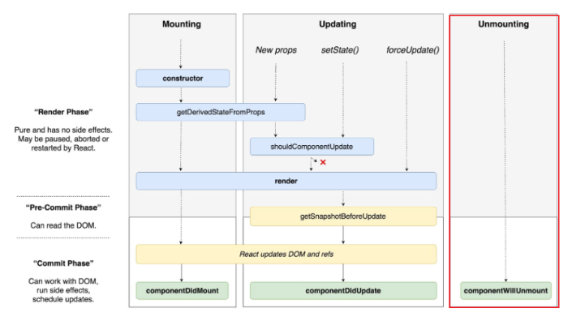

# 2.3 클래스 컴포넌트와 함수 컴포넌트

## 2.3.1 클래스 컴포넌트

기본적으로 클래스 컴포넌트를 만들기 위해서는 클래스를 선언하고 extends로 만들고 싶은 컴포넌트를 extends해야한다.
extends 구문에 넣을 수 있는 클래스는 다음과 같다.

- React.Component
- React.PureComponent
  <br/>

```js
//클래스 컴포넌트 예제
import React from 'react'

// props 타입을 선언
interface SampleProps {
    required?: boolean
    text: string
}

// state 타입을 선언
interface SampleState {
    count: number
    isLimited?: boolean
}

// Component에 제네릭으로 props, state를 순서대로 넣어준다
class SampleComponent extends React.Component<SampleProps, SampleState>{
    // constrctor에서 props를 넘겨주고, state의 기본값을 설정한다.
    private constructor(props: SampleProps){
        super(props) //상위 컴포넌트 즉,React.Component의 생성자 함수 먼저 호출 해 상위 컴포넌트에 접근 가능
        this.state = {
            count: 0,
            isLimited: false,
        }
        //constructor에서 this 바인드
        //this.handleClick=this.handleClick.bind(this)
    }

    // render내부에서 쓰일 함수를 선언
    private handleClick = () => {
        const newValue = this.state.count + 1
        this.setState({count: newValuem isLimited: newValue >= 10})
    }

    // render에서 이 컴포넌트가 렌더링할 내용을 정의한다.
    public render(){
        // props와 state 값을 this, 즉 해당 클래스에서 꺼낸다
        const {
            props: {required, text},
            state: {count, isLimited},
        } = this

        return(
            <h2>
                Sample Component
                <div>{required ? '필수' : '필수아님'}</div>
                <div>문자: {text} </div>
                <div>count: {count}</div>
                <button onClick={this.handleClick} disabled={isLimited}>
                    증가
                </button>
            </h2>
        )
    }
}
```

constructor() : 컴포넌트 내부에 이 생성자 함수가 있다면 컴포넌트가 초기화되는 시점에 호출된다. 여기서는 컴포넌트의 state를 초기화할 수 있다. 그리고 여기에 선언돼 있는 super()는 컴포넌트를 만들면서 상속받은 상위 컴포넌트, 즉 React.Component의 생성자 함수를 먼저 호출해 필요한 상위 컴포넌트에 접근할 수 있게 도와준다.

props: 함수에 인수 넣는것과 비슷하게, 특정 속성 전달

state: 클래스컴포넌트 내부에서 관리하는 값, 이값은 항상 객체이다. 이 값에 변화가 있을때 마다 리렌더링이 발생

메서드: 렌더링 함수 내부에서 사용되는 함수, 보통 DOM에서 발생하는 이벤트와 함께 사용한다.
만드는 방식

- constructor에서 this 바인드를 하는 방법 : 생성자가 아닌 일반함수에서 this를 호출하면 undefined가 바인딩되기 때문에 생성된 함수에 bind를 활용해 강제로 this를 바인딩 해야 한다.

- 화살표 함수를 쓰는 방법: 실행 시점이 아닌 작성 시점에 this가 상위 스코프로 결정된다
- 렌더링 함수 내부에서 새로운 함수를 새롭게 만들어 전달하는 방법: 렌더링 함수 내부에서 새롭게 함수 만들어 전달, 렌더링이 일어날 때마다 새로운 함수 생성해서 활당 하므로 최적화가 어려움 -> 지양

### 클래스 컴포넌트의 생명주기 메서드

생명주기는 클래스 컴포넌트에서 자주 언급된다.

생명주기가 실행되는 시점

- 마운트(mount): 컴포넌트가 마우팅(생성)되는 시점
- 업데이트(update): 이미 생성된 컴포넌트의 내용이 변경(업데이트)되는 시점
- 언마운트(unmount): 컴포넌트가 더 이상 존재하지 않는 시점

### render() :

생명주기 메서드 중 하나로 리액트 클래스 컴포넌트의 유일한 필수 값으로 항상 쓰인다.
ui를 렌더링(마운트,업데이트)

항상 순수+ 부수효과가 있어서는 안된다.(같은 입력값(proprs or state)이 들어가면 항상 같은 결과물 반환)

-> render() 내부에서 state 를 직접 업데이트하는 this.setState를 호출하면 안된다(클래스 컴포넌트의 메서드나 다른 생명주기 메서드에서 발생해야한다.)

### componentDidMount() :

componentDidMount()는 컴포넌트 업데이트가 일어난 이후 바로 실행된다.
render(과 다르게) 함수 내부에서 this.setstate()로 state값 변경 가능

this.setState를 호출하면 state가 변경되고 . 즉시 렌더링을 시도하는데, 브라우저가 실제로 ui를 업데이트 하기전에 실행되어서 사용자가 변경되는 것을 눈치 못챈다.

그러나 일반적으로 state를 다루는건 생성자에서 하는게 좋다(성능이슈)

### componentDidUpdate() :

컴포넌트 업데이트 이후 바로 실행, state나 props의 변화에 따라 DOM을 업데이트

this.setState를 사용 가능하지만 적절한 조건문으로 감싸지 않는다면 this.setState가 계속되서 호출 될수도 있다.(성능 이슈)

```js
componentDidUpdate(prevProps :Props,preState: State){
  //조건문을 통해 매순간 fetchData가 실행되는걸 막는다
  //props의 userName이 이전과 다른경우에만 호출된다

  if(this.props.userName!==prevProps.userName){
    this.fetchData(this.props.userName)
  }

}
```

### componentWillUnmount()

컴포넌트가 언마운트 되거나 사용되지 않기 직전에 호출

메모리 누수나 불필요한 작동을 막기 위한 클린업 함수를 호출하기 위한 최적의 위치다.
이 메서드 내에서는 this.setState를 호출할 수 없다.

```js
componentWillUnmount(){
    window.removeEventListener('resize', this.resizeListener)
    clearInterval(this.intervalId)
}//이벤트를 지우거나 api호출 취소 ,setInterval,setTimeout 과 같이 생성된 타이머 등을 지우는 작업으로 유용
```

### shouldComponentUpdate()

state나 props의 변경으로 리액트 컴포넌트가 다시 리렌더링되는 것을 막고 싶다면 이 생명주기 메서드를 사용하면 된다.
기본적으로 this.setState가 호출되면 컴포넌트는 리렌더링을 일으킨다.

그러나 이 생명주기 메서드를 활용하면 컴포넌트에 영향을 받지 않는 변화에 대해 정의할 수 있다.

```js
shouldComponentUpdate(nextProps: Props, nextState: State){
   // true인 경우, 즉 props의 title이 같지 않거나 state의 input이 같지 않은 경우
   // 컴포넌트를 업데이트한다. 이외의 경우에는 업데이트하지 않는다.
   return this.props.title !== nextProps.title || this.state.input !== nextState.input
}
```

<br/><br/><br/><br/>

### Component와 PureComponent의 차이 : 생명주기를 다루는데에 있다.

Component의 경우 state가 업데이트되는 대로 렌더링이 일어나지만 PureComponent는 state 값에 대해 얕은 비교를 수행해 결과가 다를 때만 렌더링을 수행한다.

무조건 pureComponent가 좋을까?
-> 아니다. 객체와 같이 무거운 구조의 state 데이터 변경은 감지하지 못하기에 제대로 작동하지 않는다.

### static getDerivedStateFromProps()

render()이 호출되기 직전에 호출되는 메서드
static으로 선언되어 있어 this로 접근 불가능하다.

반환하는 객체는 해당 객체의 내용이 모두 state로 들어간다

null을 반환하면 아무일 x

중요한점은 이 **메서드도 모든 render( )실행시에 호출된다.**

### getSnapShotBeforeUpdate()

componentWillUpdate()를 대체할 수 있는 메서드다.

DOM이 업데이트되기 직전에 호출된다.

반환되는 값은 componentDidUpdate로 전달된다.

DOM에 렌더링되기 전에 윈도우 크기를 조절하거나 스크롤 위치를 조정하는 등의 작업을 처리하는 데 유용하다.



### getDerivedStateFromError

에러 상황에 실행되는 메서드

뒤에 소개할 componentDidCatch메서드는 정상적인 생명 주기에서 실행되는 메서드가 아니라 에러 상황에서 실행되는 메서드다.
또한 이 두 메서드와 앞서 소개한 getSnapShotBeforeUpdate는 아직 리액트 훅으로 구현돼 있지 않기 때문에 이 세 가지 메서드가 필요한 경우가 있다면 반드시 클래스 컴포넌트를 사용해야 한다.

getDerivedStateFromError는 자식 컴포넌트에서 에러가 발생했을 때 호출되는 에러 메서드다.
이 에러 메서드를 활용하면 적절한 에러 처리 로직을 구현할 수 있다.

```js
static getDerivedStateFromError(error: Error){ //하위 컴포넌트에서 발새앟ㄴ 에러

      return{
        hasError: true,
        errorMessage: error.toString(),
    }
}
```

또한 반드시 state값을 반환한다.
그 이유는 getDerivedStateFromError의 실행 시점 때문이다

또한, 렌더링 과정에서 호출되는 메서드이기 때문에 부수 효과를 발생시켜서는 안 된다.

이 부수 효과란, 에러에 따른 상태 state를 반환하는 것 외의 모든 작업을 의미한다.

console.log(error)와 같은 에러 로깅 작업이 이에 해당한다.이러한 작업이 하고 싶다면 뒤이어 소개할 componentDidCatch를 사용하면 된다.

### componentDidCatch

자식컴포넌트에서 에러가 발생했을 때 실행
(getDerivedStateFromError에서 에러를 잡고 state를 결정한 이후에 실행된다.)

인수는 2개를 받는다

- getDerivedStateFromError과 동일한 error
- 어떤 컴포넌트가 에러를 발생시켰는지의 정보 info

getDerivedStateFromError()에서 하지 못한 부수효과 수행 가능 이는 render 단계에서 실행되지 않고 커밋 단계에서 실행되기 때문이다.

```js
funciton App(){
    return(
        <ErrorBoundary name="parent">
            // Child에서 발생한 에러는 여기서 잡힌다.
            <ErrorBoundary name="child">
                <Child />
            </ErrorBoundary>
        </ErrorBoundary>
    )
}
```

### 클래스 컴포넌트의 한계

- 데이터 흐름의 추적 어렵다.:state흐름
- 애플리케이션 내부 로직의 재사용 어렵다.
- 기능이 많아 질수록 컴포넌트의 크기가 커진다.
- 클래스는 함수에 비해 상대적으로 어렵다
- 코드 크기 최적화 어렵다
- 핫 리로딩을 하는데 상대적으로 불리하다: 핫 리로딩이란 코드에 변경 사항이 발생 했을 때 앱을 다시 시작하지 않고서도 해당 변경된 코드만 업데이트해 변경 사항을 빠르게 적용하는 기법이다. (주로 개발단계에서 사용)

## 2.3.2 함수 컴포넌트

```js

import {useState} from 'react'

type SampleProps = {
    required?: boolean
    text: string
}

export function SampleComponent({required, text}: SampleProps){
    const [count, setCount] = useState<number>(0)
    const [isLimited, setIsLimited] = useState<boolean>(false)

    function handleClick(){
        const newValue = count + 1
        setCount(newValue)
        setIsLimited(newValue >= 10)
    }

    return (
        <div></div>
    )
}
```

장점

- render 내부에서 필요한 함수를 선언할때 this 바인딩 조심 안해도 됨
- state는 객체가 아닌 각각 원시값으로 관리
- return 에서도 굳이 this 사용하지 않고 props와 state 접근 가능

## 2.3.3 함수 컴포넌트 vs 클래스 컴포넌트

차이점으로 가장 큰 부분은 **함수 컴포넌트는 생명 주기 메서드가 없는 것**

- 이유로는 함수컴포넌트는 props를 받아 단순 리액트요소만 반환하는 함수
- 클래스 컴포넌트는 render 메서드가 있는 React.Component를 상속받아 구현하는 클래스이기 때문이다. 즉 생명주기 메서드가 REact.Componet에서 오는 것이기에 클래스 컴포넌트가 아니면 생명주기 메서드를 사용할 이유가 없다.

-> 반면 함수 컴포넌트는 useEffect 훅을 사용해 componentDidMount, componentDidUpdate, componentWillUnmount를 비슷하게 구현할 수 있다.( 같은 거는 아님 useEffect는 생명주기를 위한 훅이 아니다 **useEffect는 컴포넌트의 state를 활용해 동기적으로 부수 효과를 만드는 메커니즘**)

### 함수 컴포넌트와 렌더링 된 값

함수 컴포넌트는 렌더링된 값을 고정하고, 클래스 컴포넌트는 그렇지 못한다는 사실

> 함수형 컴포넌트와 클래스형 컴포넌트가 클릭후 3초후 alert하는 코드일때

    3초사이에 값을 바꾸면 클래스형 컴포넌트는 3초뒤의 값을 보여주고 함수형 컴포넌트는 클릭시점의값을 보여준다.

클래스 컴포넌트의 경우 props의 값을 항상 this로부터 가져온다.
클래스 컴포넌트의 props는 외부에서 변경되지 않는 이상 불변 값이지만 this가 가리키는 객체, 즉 컴포넌트의 인스턴스의 멤버는 변경 가능한 값이다. 따라서 render메서드를 비롯한 리액트의 생명주기 메서드가 변경된 값을 읽을 수 있게 된다.

이 경우 부모 컴포넌트가 props를 변경해 컴포넌트가 다시 렌더링됐다는 것은 this.props의 값이 변경된 것이다.

함수형 컴포넌트의 경우에 props를 인수로 받고, this와 다르게, props는 인수로 받기 때문에 컴포넌트는 값을 변경할 수 없다(state 도 마찬가지)

함수 컴포넌트는 렌더링이 일어날때마다 props 와 state를 기준으로 렌더링된다. 변경된다면 그 값에 따라 렌더링

반면 클래스 컴포넌트는 시간에 흐름에 따라 변화하는 this를 기준으로 렌더링
