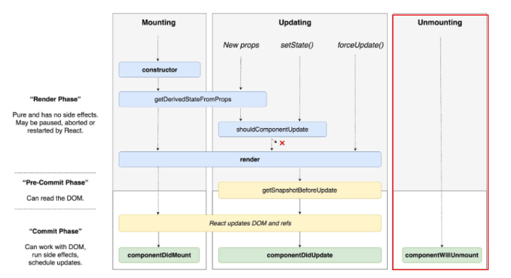

# 2.4. 렌더링은 어떻게 일어나는가?

브라우저의 렌더링:HTML,CSS 를 기반으로 UI 그리는 과정
리액트의 랜더링 : 브라우저가 랜더링에 필요한 DOM 트리를 만드는 과정을 의미한다.

## 2.4.1 리액트의 렌더링이란?

브라우저의 렌더링과 혼동하면 안된다.

리액트의 렌더링이란, 리액트 에플리케이션 트리 안에 있는 모든 컴포넌트들이 현재 자신들이 가지고 있는 props와 state 의 값을 기반으로 어떻게 ui를 구성하고 이를 바탕으로 어떤 DOM 결과를 브라우저에 제공할 것인지 계산하는 일련의 과정이다.

만약 props나 state를 가지고 있지 않다면 오직 해당 컴포넌트가 반환하는 jsx값에 기반해 렌더링이 일어나게 된다.

## 2.4.2. 리액트의 렌더링이 일어나는 이유

최초 렌더링 : 사용자가 처음 애플리케이션에 진입하면 당연히 렌더링해야 할 결과물이 필요하다. 리액트는 브라우저에 이 정보를 제공하기 위해 최초 렌더링을 수행한다 .

리렌더링 : 리렌더링은 처음 애플리케이션에 진입했을 때 최초 렌더링이 발생한 이후로 발생하는 모든 렌더링을 의미.

- 클래스 컴포넌트의 setState가 실행되는 경우
- 클래스 컴포넌트의 forceUpdate가 실행되는 경우
  - render가 state나 props 외에 다른값에 의존하고 있어 리렌더링을 자동으로 실행할 수 없는 경우 forceUpdate 사용
- 함수 컴포넌트의 useState()의 두 번째 요소인 setter가 실행되는 경우
- 함수 컴포넌트의 useReducer()의 두 번째 요소인 dispatch가 실행되는 경우
- 컴포넌트의 key props가 변경되는 경우

  - 리액트에서 key는 명시적으로 선언되어 있지 않아도 모든 컴포넌트에서 사용할 수 있는 특수한 props이다. 일반적으로 배열에서 자주 사용된다.

  ```js
  return (
    <ul>
      {arr.map(index => (
        <li key={index}>{index}</li>
      ))}
    </ul>
  );
  ```

> 키가 필요한 이유?
> 리액트에서 key는 리렌더링이 발생하는 동안 형제 요소들 사이에서 동일한 요소를 식별하는 값이다.
> 리액트 파이버 트리구조에서 형제 컴포넌트를 구별하기위해 sibling이라는 속성 값 사용하는데, 동일한 자식 컴포넌트가 여러개 있는 구조에서 리렌더링이 발생하면 current 트리와 workInProgress 트리 사이에서 어떠한 컴포넌트의 변경이 있는지 구별해야하는데 같은컴포넌트인지를 확인하는 값이 key이다.

-

### 2.4.3. 리액트의 렌더링 프로세스

렌더링 프로세스가 시작되면 리액트는 컴포넌트의 루트부터 차근차근 아래쪽으로 내려가 업데이트 필요하다고 지정된 컴포넌트를 찾는다.

발견하면 클래스 컴포넌트의 경우 : render()함수 실행

함수 컴포넌트의 경우 : FuntionComponet 그 자체를 호출 한뒤 , 결과 저장

렌더링 프로세스가 실행되면 각 컴포넌트의 렌더링 결과물을 수집한 다음, 리액트의 새로운 트리인 가상 DOM과 비교해 실제 DOM에 반영하기 위한 모든 변경 사항을 수집한다.

#### 이 과정이 2.2절이 가상 DOM과 리액트 파이버에서 다뤘던 리액트의 재조정이다.

렌더링은 렌더와 커밋 두단계로 분리되어 실행된다

### 2.4.4 렌더와 커밋

### 렌더 : 컴포넌트를 렌더링하고 변경 사항을 계산하는 모든 작업

즉, 렌더링 프로세스에서 컴포넌트를 실행해(reder() return) 이 결과와 이전 가상 DOM을 비교하는 과정을 거쳐 변경이 필요한 컴포넌트를 체크하는 단계

체크하는 것
( type, props , key)

이 셋중 바뀐게 있으면 변경이 필요한 컴포넌트로 체크

### 커밋 : 렌더 단게의 변경 사항을 실제 DOM에 적용해 사용자에게 보여주는 과정

커밋 이후에 브라우저의 렌더링이 발생한다.

리액트가 먼저 DOM을 커밋 단게에서 업데이트한다면 이렇게 만들어진 모든 DOM 노드 및 인스턴스를 가리키도록 리액트 내부의 참조를 업데이트한다.
그 다음, 클래스 컴포넌트에서는 componentDidMount, componentDidUpdate 메서드를 호출하고, 함수 컴포넌트에서는 useLayoutEffect 훅을 호출한다.

### 여기서 알 수 있는 중요한 사실은 리액트의 렌더링이 일어난다고 해서 무조건 DOM 업데이트가 일어나는 것은 아니라는 것이다.

리액트의 렌더링을 수행했으나 커밋 단계까지 갈 필요가 없다면 ( 변경 사항이 감지되지 않을 때) 커밋 생략 가능



이 두 과정에서 리액트의 렌더링은 항상 동기식 -> 길어지면 성능저하

하지만 리엑트 18부터 **동시성 렌더링 도입**

`동시성 렌더링` 렌더링 중 렌더 단계가 비동기로 작동해 특정 렌더링의 우선순위를 낮추거나, 필요하다면 중단하거나 재시작하거나, 경우에 따라서는 포기할 수도 있다.
이를 통해 브라우저의 동기 작업을 차단하지 않고 백그라운드에서 새로운 리액트 트리를 준비할 수도 있으므로 사용자는 더욱 매끄러운 사용자 경험을 누릴 수 있다.

## 2.4.5 일반적인 렌더링 시나리오 살펴보기

```js
import {useState} from 'react'

export default function A(){
    return(
        <div className="App">
            <h1>Hello React</h1>
            <B />
        </div>
    )
}

function B(){
    const [counter, setCounter] = useState(0)

    function handleButtonClick(){
        setCounter((prev) => prev+1)
    }

    return(
        <>
            <label>
                <C number={counter}>
            </label>
            <button onClick={handleButtonClick}>+</button>
        </>
    )
}

function C({number}){
    return(
        <div>
            {nubmer} <D />
        </div>
    )
}

function D(){
    return <>리액트 재밌다!</>
}
```

렌더링 순서

```
1.B컴포넌트의 setState가 호출된다.
2.B컴포넌트의 리렌더링 작업이 렌더링 큐에 들어간다.
3.리액트는 트리 최상단에서부터 렌더링 경로를 검사한다.
4.A 컴포넌트는 리렌더링이 필요한 컴포넌트로 표시돼 있지 않으므로 별다를 작업을 하지 않는다.
5. 그다음 하위 컴포넌트인 B컴포넌트는 업데이트가 필요하다고 체크돼 있으므로 B를 리렌더링한다.
6. 5번 과정에서 B는 C를 반환했다.
7.C는 props인 number가 업데이트됐다. 그러므로 업데이트가 필요한 컴포넌트로 체크돼 있고 업데이트한다.
8.7번 과정에서 C는 D를 반환했다.
9.D도 마찬가지로 업데이트가 필요한 컴포넌트로 체크되지 않았다. 그러나 C가 렌더링됐으므로 그 자식인 D도 렌더링됐다.
```
