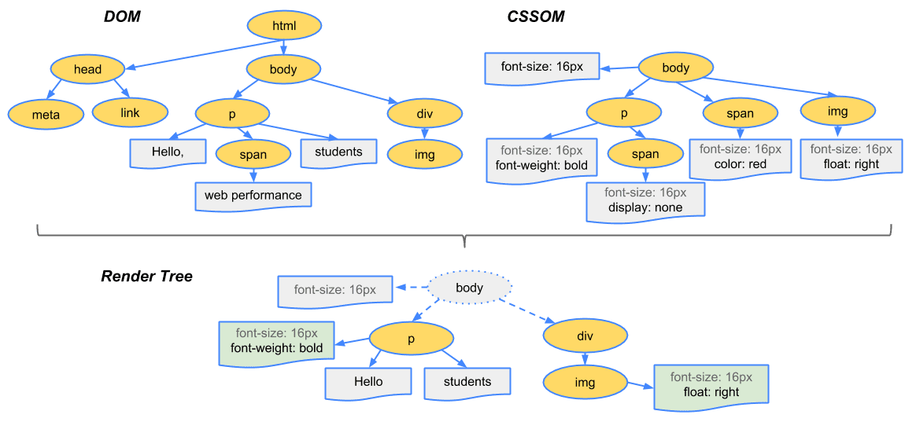
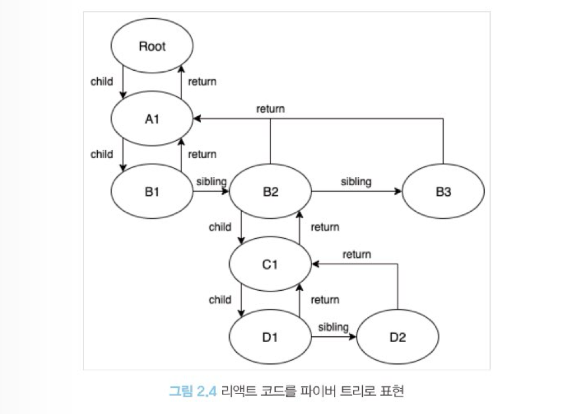

# **2장 리액트 핵심 요소 깊게 살펴보기**

## 2.2 가상 DOM과 리액트 파이버

### 2.2.1 DOM과 브라우저 렌더링 과정
`DOM`은 <span style="background-color:#fff5b1">웹페이지에 대한 인터페이스</span>로 브라우저가 웹페이지의 콘텐츠와 구조를 어떻게 보여줄지에 대한 정보를 담고 있다. 본격적인 DOM의 정의를 다루기에 앞서 먼저 브라우저가 웹사이트 접근 요청을 받고 화면을 그리는 과정에서 정확히 어떤 일이 일어나는지 살펴보자.

>1. 브라우저가 사용자가 요청한 주소를 방문해 HTML 파일을 다운로드한다.
>2. 브라우저의 렌더링 엔진은 HTML을 파싱해 DOM 노드로 구성된 트리(DOM)를 만든다.
>3. 2번 과정에서 CSS 파일을 만나면 해당 CSS 파일도 다운로드한다.
>4. 브라우저의 렌더링 엔진은 이 CSS도 파싱해 CSS 노드로 구성된 트리(CSSOM)를 만든다.
>5. 브라우저는 2번에서 만든 DOM 노드를 순회하는데, 여기서 모든 노드를 방문하는 것이 아니고 사용자 눈에 보이는 노드만 방문한다. 즉. display: none과 같이 사용자 화면에 보이지 않는 요소는 방문해 작업하지 않는다. 이는 트리를 분석하는 과정을 조금이라도 빠르게 하기 위해서다.
>6. 5번에서 제외된, 눈에 보이는 노드를 대상으로 해당 노드에 대한 CSSOM 정보를 찾고 여기서 발견한 CSS 스타일 정보를 이 노드에 적용한다. 이 DOM 노드에 CSS를 적용하는 과정은 크게 두 가지로 나눌 수 있다.<br><br>
• 레이아웃(layout, reflow): 각 노드가 브라우저 화면의 어느 좌표에 정확히 나타나야 하는지 계산하는 과정. 이 레이아웃 과정을 거치면 반드시 페인팅 과정도 거치게 된다.<br>
• 페인팅(painting): 레이아웃 단계를 거친 노드에 색과 같은 실제 유효한 모습을 그리는 과정.<br>

⬆️ DOM과 CSSOM으로 렌더링 트리가 만들어지는 과정

이렇게 모든 단계를 거친 최종 출력물은 웹 애플리케이션의 모든 콘텐츠와 스타일 정보를 갖게 된다. 이제 코드로 위 과정이 어떻게 일어나는지 직접 살펴보자.

```html
#text {
background-color: red;
color: white;
}
<! DOCTYPE html>
<html>
<head>
<link rel="stylesheet" type="text/css" href="./style.css" /›
ctitle>Hello React!</title>
</head>
< body>
<div style="width: 100%;">
〈div id="text" style="width: 50%;">Hello world!</div>
</div>
</body>
</html>
```

>1. HTML을 다운로드한다. 다운로드와 함께 HTML을 분석하기 시작한다.
>2. 스타일시트가 포함된 link 태그를 발견해 styLe.css를 다운로드한다.
>3. body 태그 하단의 div는 width: 100%이므로 뷰포트(브라우저가 사용자에게 노출하는 영역)로 좌우 100% 너비로 잡 는다.
>4. 3번 하단의 div는 width: 50%, 즉 부모의 50%를 너비로 잡아야 하므로 전체 영역의 50%를 너비로 잡는다.
>5. 2번에서 다운로드한 CSS에 id="text"에 대한 스타일 정보를 결합한다.
>6. 화면에 HTML 정보를 그리기 위한 모든 정보가 준비됐으므로 위 정보를 바탕으로 렌더링을 수행한다.

<br>

### 2.2.2 가상 DOM의 탄생 배경<br>
DOM은 웹페이지가 변경되는 상황에 대한 비용이 너무 많이 든다. 이를 해결하기 위해 탄생한 것이 바로 `가상 DOM`이다. 

`가상 DOM`은 실제 DOM의 가벼운 복사본으로서, 메모리 상에서 처리가 가능하다. <br>컴포넌트의 상태 변화가 발생하면, 리액트는 이를 가상 DOM에 적용하여 실제 DOM과의 차이를 계산하고, 변경된 부분만 실제 DOM에 반영한다. 이렇게 함으로써 <span style="background-color:#fff5b1">불필요한 DOM 조작을 최소화하고 성능을 향상시킨다.</span>

<br>

### 2.2.3 가상 DOM을 위한 아키텍처, 리액트 파이버<br>
이러한 가상 DOM과 렌더링 과정 최적화를 가능하게 해주는 것이 바로 `리액트 파이버(React Fiber)`다.

<br>

`리액트 파이버란?`<br>
리액트 파이버는 리액트에서 관리하는 평범한 자바스크립트 객체다.<br>
파이버는 <span style="background-color:#fff5b1">파이버 재조정자(fiber reconsciler)</span>가 관리한다. 이는 가상 DOM과 실제 DOM을 비교해 변경 사항을 수집하며, 만약 이 둘 사이에 차이가 있으면 <span style="background-color:#fff5b1">변경에 관련된 정보를 가지고 있는 파이버</span>를 기준으로 화면에 렌더링을 요청하는 역할을 한다.

<span style="background-color:#fff5b1">리액트 파이버의 목표</span>는 리액트 웹 어플리케이션에서 발생하는 애니메이션, 레이아웃, 그리고 사용자 인터랙션에 올바른 결과물을 만드는 반응성 문제를 해결하는 것이다. 

이를 위해 파이버는 다음과 같은 일을 할 수 있다.

>- 작업을 작은 단위로 분할하고 쪼갠 다음, 우선순위를 매긴다.<br>
>- 이러한 작업을 일시 중지하고 나중에 다시 시작할 수 있다.
<br>(우선순위가 높은 다른 작업을 처리한 후에 다시 중단된 작업을 재개)<br>
>- 이전에 했던 작업을 다시 재사용하거나 필요하지 않은 경우에는 폐기할 수 있다.

한 가지 중요한 것은 <span style="background-color:#fff5b1">이러한 모든 과정이 비동기로 일어난다는 것</span>이다.

❓ 파이버는 어떻게 구현돼 있을까? <br>
`파이버`는 일단 하나의 작업 단위로 구성돼 있다.<br> 리액트는 이러한 작업 단위를 하나씩 처리하고 finishedWork()라는 작업으로 마무리한다.
<br> 그리고 이 작업을 실제 브라우저 DOM에 가시적인 변경 사항을 만들어 낸다.

이러한 단계는 아래 두 단계로 나눌 수 있다.

>1. 렌더 단계에서 리액트는 사용자에게 노출되지 않는 모든 비동기 작업을 수행한다. <br>
그리고 이 단계에서 앞서 언급한 파이버의 작업, 우선순위를 지정하거나 중지시키거나 버리는 등의 작업이 일어난다.
>2. 커밋 단계에서는 앞서 언급한 것처럼 DOM에 실제 변경 사항을 반영하기 위한 작업, commitWork()가 실행되는데, 이 과정은 <span style="background-color:#fff5b1">앞서와 다르게 동기식으로 일어나고 중단될 수도 없디.</span>


파이버는 리액트 요소와의 차이점은 리액트 요소는 렌더링이 발생할 때마다 새롭게 생성되지만,<br>
파이버는 컴포넌트가 최초로 마운트되는 시점에 생성되어 <span style="background-color:#fff5b1">가급적이면 재사용된다</span>는 사실이다.

`리액트 파이버 구현체 주요 속성`
- tag : 파이버는 하나의 element에 하나가 생성되는 1:1 관계를 가지고 있는데, <br>
여기서 1:1로 매칭된 정보를 가지고 있는 것이 바로 tag다.
- stateNode : 파이버 자체에 대한 참조(reference) 정보를 가지고 있으며,<br>
 이 참조를 바탕으로 리액트는 파이버와 관련된 상태에 접근한다.
- child, sibling, return : 파이버 간의 관계 개념을 나타내는 속성이다.<br>
리액트 컴포넌트 트리가 형성되는 것과 동일하게 파이버도 트리 형식을 갖게 되는데, 이 트리 형식을 구성하는데 필요한 정보가 이 속성 내부에 정의된다.<br>
한 가지 리액트 컴포넌트 트리와 다른 점은 하나의 child만 존재한다는 점이다.
- index : 여러 sibling 사이에서 자신의 위치가 몇 번째인지 숫자로 표현
- pendingProps : 아직 작업을 미처 처리하지 못한 props
- memoizedProps : pendingProps를 기준으로 렌더링이 완료된 후에 pendingProps를 memoizedProps로 저장해 관리한다.
- updateQueue : 상태 업데이트, 콜백함수, DOM 업데이트 등 필요한 작업을 담아두는 큐
- memoizedState : 함수 컴포넌트의 훅 목록이 저장된다. 모든 훅 리스트가 저장됨
- alternate : 리액트의 트리는 두개인데, 이 alternate는 반대편 트리 파이버를 가리킨다.

<br>
이렇게 생성된 파이버는 state가 변경되거나 생명주기 메서드가 실행되거나 DOM의 변경이 필요한 시점 등에 실행된다.
<br>중요한 것은 <span style="background-color:#fff5b1">리액트가 파이버를 처리할 때마다 이러한 작업을 직접 바로 처리하기도 하고 스케줄링하기도 한다는 것</span>이다.
<br><br>
즉, 이러한 작업들은 작은 단위로 나눠서 처리할 수도, 애니메이션과 같이 우선순위가 높은 작업은 가능한 한 빠르게 처리하거나, 낮은 작업을 연기시키는 등 좀 더 유연하게 처리된다.
<br><br>
사실 리액트는 가상 DOM이 아닌 Value UI, 즉 값을 가지고 있는 UI를 관리하는 라이브러리다.<br>
파이버의 객체 값에서도 알 수 있듯이 리액트의 핵심 원칙은 UI를 문자열, 숫자, 배열과 같은 값으로 관리한다는 것이다.<br>
<span style="background-color:#fff5b1">변수에 이러한 UI 관련 값을 보관하고, 리액트의 자바스크립트 코드 흐름에 따라 이를 관리하고, 표현하는 것이 바로 리액트다.</span>


<br>
<br>

`리액트 파이버 구현체 주요 속성`<br>
리액트 내부에서 파이버 트리는 두 개가 존재한다.<br>
하나는 현재 모습을 담은 파이버 트리, 다른 하나는 작업중인 상태를 나타내는 workInProgress 트리다.<br>
리액트 파이버의 작업이 끝나면 리액트는 단순히 포인터만 변경해 workInProgress 트리를 현재 트리로 바꿔버린다.<br>
이러한 기술을 <span style="background-color:#fff5b1">더블 버퍼링</span>이라고 한다.

리액트에서도 불완전한 트리를 보여주지 않기 위해 커밋 단계에서 더블 버퍼링 기법을 쓴다.<br>
즉, 먼저 현재 UI 렌더링을 위해 존재하는 트리인 current를 기준으로 모든 작업이 시작된다.<br>
업데이트가 발생하면 파이버는 리액트에서 새로 받은 데이터로 새로운 workInProgress 트리를 빌드하기 시작한다. 

이 workInProgress 트리를 빌드하는 작업이 끝나면 다음 렌더링에 이 트리를 사용한다.<br>
그리고 이 workInProgress 트리가 UI에 최종적으로 렌더링되어 반영이 완료되면 current가 이 workInProgress로 변경 된다.


<br>

`파이버의 작업 순서`<br>
```javascript
<A1>

<B1>안녕하세요</B1>

<B2>

<C1>

<D1 />

<D2 />

</C1>

</B2>

<В3 />

</A1>
```
위 작업은 해당 JSX 코드에서 다음과 같이 수행된다.
>1. A1의 beginwork()가 수행된다.
>2. A1은 자식이 있으므로 B1로 이동해 beginWork()를 수행한다.
>3. B1은 자식이 없으므로 completeNork()가 수행됐다. 자식은 없으므로 형제인 82로 넘어간다.
>4. B2의 beginwork()가 수행된다. 자식이 있으므로 1로 이동한다.
>5. C1의 beginwork()가 수행된다. 자식이 있으므로 01로 이동한다.
>6. 01의 beginwork()가 수행된다.
>7. D1은 자식이 없으므로 completework()가 수행됐다. 자식은 없으므로 형제인 D2로 넘어간다.
>8. D2는 자식이 없으므로 completeWork()가 수행됐다.
>9. D2는 자식도 더 이상의 형제도 없으므로 위로 이동해 01, C1, B2 순으로 completeNork()를 호출한다.
>10. 82는 형제인 B3으로 이동해 beginwork()를 수행한다.
>11. B3의 completeWork()가 수행되면 반환해 상위로 타고 올라간다.
>12. A1의 completework()가 수행된다.
>13. 루트 노드가 완성되는 순간, 최종적으로 commitWork()가 수행되고 이 중에 변경 사항을 비교해 업데이트가 필요한 변경 사항이 DOM에 반영된다.

beginwork() -> completework() -> commitWork()

이렇게 생성한 트리를 도식화하면 다음과 같다.


업데이트가 발생하면, 이미 리액트는 앞서 만든 current 트리가 존재하고, <br>
업데이트 요청을 받아 workInProgress 트리를 다시 빌드하기 시작한다. 이 빌드 과정은 앞서 트리를 만드는 과정과 동일하다.
<span style="background-color:#fff5b1">최초 렌더링이 아니므로 되도록 파이버를 새로 생성하지 않고 기존 파이버에서 업데이트된 props를 받아</span> 파이버 내부에서 처리한다.
기존 객체를 재활용하기 위해 내부 속성값만 초기화하거나 바꾸는 형태로 트리를 업데이트한다.


<br>

### 2.2.4 파이버와 가상 DOM<br>

리액트 컴포넌트에 대한 정보를 1:1로 가지고 있는 것이 파이버이며, 이 파이버는 리액트 아키텍처 내부에서 비동기로 이뤄진다.<br>
이와 달리, 실제 브라우저 구조인 DOM에 반영하는 것은 동기적으로 일어나야 하고, 또 처리하는 작업이 많아 화면에 불완전하게 표시될 수 있으므로 이러한 작업을 가상에서,
즉 메모리상에서 먼저 수행해서 최종적인 결과물만 실제 브라우저 DOM에 적용하는 것이다.

<span style="color:gray">* 실제 DOM은 변경사항이 생기면 즉시 반영이 된다 -> 비용이 많이 들고 작은 변경사항이 발생할 때마다 리렌더링이 발생하기 때문에 성능저하가 발생할 수 있다.</span>