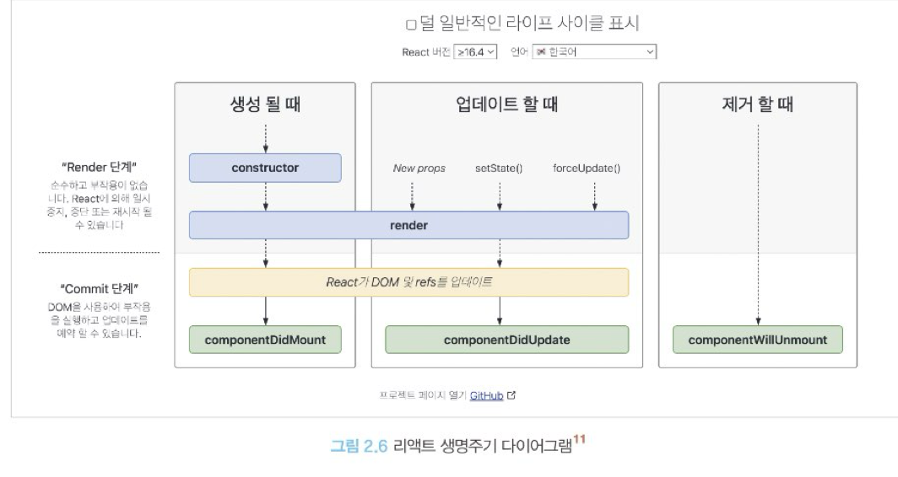

# **2장 리액트 핵심 요소 깊게 살펴보기**

## 2.3 클래스 컴포넌트와 함수 컴포넌트
과거 클래스 컴포넌트 vs 함수 컴포넌트
### 2.3.1 클래스 컴포넌트
오래된 코드의 유지보수 내지는 오래전에 개발된 라이브러리 등을 사용할 때 도움을 얻기 위해서는 기본적인 클래스 컴포넌트의 구조를 이해할 필요가 있다.

```javascript
import React from 'react'

class SampleComponent extends React.Component {
    render() {
        return <h2>Sample Component</h2>
    }
}
```
기본적으로 클래스 컴포넌트를 만들려면 클래스를 선언하고 extends로 만들고 싶은 컴포넌트를 extends해야 한다. 구문에 넣을 수 있는 클래스는 다음과 같다.
- React.Component
- React.PureComponent

<br><br>

`클래스 컴포넌트의 생명주기 메서드`<br>
먼저 생명주기 메서드가 실행되는 시점은 크게 3가지로 나눌 수 있다.
- 마운트(mount) : 컴포넌트가 마운팅(생성)되는 시점
- 업데이트(update) : 이미 생성된 컴포넌트의 내용이 변경(업데이트)되는 시점
- 언마운트(unmount) : 컴포넌트가 더 이상 존재하지 않는 시점

이 세 가지 시점을 염두에 두고 각 생명주기 메서드를 살펴보자.

**render()** <br>
리액트 클래스 컴포넌트의 유일한 필수 값으로 항상 쓰인다. 이 함수는 컴포넌트가 UI를 렌더링하기 위해서 쓰인다. 이 렌더링은 <span style="background-color:#fff5b1">마운트와 업데이트 과정</span>에서 일어난다.<br>
주의할 것은 이 함수는 항상 순수해야 하며 부수 효과가 없어야 한다. 즉 render()내부에서 props나 state를 업데이트(this.setState 호출) 해서는 안된다. 들어가면 항상 같은 결과물을 반환해야 한다.<br>

<br>

**componentDidMount()** <br>
컴포넌트가 마운트되고 준비되는 즉시 실행된다. render()와는 다르게, 이 함수 내부에서는 this.setState()로 state 값을 변경하는 것이 가능하다. 이 다음에 state가 변경되고 그 즉시 다시 한 번 렌더링을 시도한다.

이 작업은 브라우저가 실제로 UI를 업데이트하기 전에 실행되어 사용자가 변경되는 것을 눈치챌 수 없게 만든다. 이건 만능이 아니며 성능 문제를 일으킬 수 있음에 주의하자. 일반적으로 state를 다루는 것은 생성자에서 하는 것이 좋다.

<br>

**componentDidUpdate()** <br>
컴포넌트 업데이트가 일어난 이후 바로 실행된다. 일반적으로 state나 props의 변화에 따라 DOM을 업데이트하는 등에 쓰인다. 여기서도 this.setState를 사용할 수 있다.

그러나 적절한 조건문으로 감싸지 않는다면 this.setState가 계속해서 호출되는 성능적으로 좋지 않은 일이 발생할 수 있다.

```javascript
componentDidUpdate(prevProps: Props, prevState: State) {
// 만약 이러한 조건문이 없다면 props가 변경되는 매 순간마다 fetchData가
// 실행되는 불상사가 발생할 것이다.
// 이 조건문 덕분에 props의 userName이 이전과 다른 경우에만 호출될 것이다.
if (this.props.userName !== prevProps.userName) {
this.fetchData(this.props.userName);
}
}
```

<br>

**componentWillUnmount()** <br>
컴포넌트가 언마운트되거나 더 이상 사용되지 않기 직전에 호출된다. 메모리 누수나 불필요한 작동을 막기 위한 클린업 함수를 호출하기 위한 최적의 위치다. 이 메서드 내에서는 this.setState를 호출할 수 없다.

```javascript
componentWillUnmount() {
window.removeEventListener('resize', this.resizeListener)
clearInterval(this.intervalId)
}
```
위 예제와 같이 이벤트를 지우거나, API 호출을 취소하거나, SetInterval, setTimeout으로 생성된 타이머를 지우는 등의 작업을 하는 데 유용하다.

<br>

**shouldComponentUpdate()** <br>
state나 props의 변경으로 리액트 컴포넌트가 다시 리렌더링 되는 것을 막고 싶다면 이 생명주기 메서드를 사용하면 된다. 기본적으로 this.setState가 호출되면 컴포넌트는 리렌더링을 일으킨다. 그러나 이 생명주기 메서드를 활용하면 컴포넌트에 영향을 받지 않는 변화에 대해 정의할 수 있다.

그러므로 이 메서드를 사용하는 것은 특정한 성능 최적화 상황에서만 고려해야 한다.

```javascript
shouldComponentUpdate(nextProps: Props, nextState: State) {
// false인 경우, 즉 props의 title이 같거나 state의 input이 같은 경우에는
// 컴포넌트를 업데이트하지 않는다.
return this.props.title != nextProps.title || this.state.input !== nextState.input
}
```

<br>
클래스 컴포넌트 두 가지 유형, Component와 PureComponent의 차이점은 이 생명주기를 다루는 데 있다.

`Component의` 경우 버튼을 누르는 대로, 즉 state가 업데이트되는 대로 렌더링이 일어나지만 `PureComponent는` state값이 업데이트되지 않아서 렌더링 일어나지 않았다. PureComponent는 state값에 대해 얕은 비교를 수행해 결과가 다를 때만 렌더링을 수행한다. (얕은 비교만 하면 결과가 다르다고 판단할 확률이 낮아서 렌더링이 잘 작동되지 않을 수 있다.)


<br>

**static getDerivedStateFromProps()** <br>
render()를 호출하기 직전에 호출된다. 한 가지 눈에 띄는 점은 static으로 선언 돼 있어 this에 접근할 수 없다는 것이다.


<br>

**getSnapShotBeforeUpdate()** <br>
componentWillUpdate()를 대체할 수 있는 메서드다. 이는 DOM이 업데이트되기 직전에 호출된다. 여기서 반환되는 값은 componentDidUpdate로 전달된다. DOM에 렌더링되기 전에 윈도우 크기를 조절하거나 스크롤 위치를 조정하는 등의 작업을 처리하는데 유용하다.


<br>

**지금까지 언급한 생명주기 메서드 정리** <br>


<br>

**getDerivedStateFromError()** <br>
렌더 단계에서 실행된다. 자식 컴포넌트에서 에러가 발생했을 때 호출되는 에러 메서드다.
<br> 이 에러 메서드를 사용하면 적절한 에러 처리 로직을 구현할 수 있다. <br>
에러에 따른 상태 state를 반환하는 것 외의 모든 작업을 발생시키면 안된다.

<br>

**ComponentDidCatch()** <br>
자식 컴포넌트에서 에러가 발생했을 때 실행되며, getDerivedStateFromError에서 에러를 잡고 state를 결정한 이후에 실행된다. 
두 개의 인수를 받는데, 첫 번째는 getDerivedStateFromError와 동일한 `error`, 
그리고 정확히 어떤 컴포넌트가 에러를 발생시켰는지 정보를 가지고 있는 `info`

이는 getDerivedStateFromError()에서 하지 못했던 부수 효과를 수행할 수 있다.
getDerivedStateFromError와는 다르게 커밋단계에서 실행되기 때문이다.<br>
즉, 리액트에서 에러 발생 시 이 메서드에서 제공되는 에러 정보를 바탕으로 로깅하는 등의 용도로 사용가능


<br><br>

`클래스 컴포넌트의 한계`<br>
클래스 컴포넌트의 한계
- 데이터의 흐름을 추적하기 어렵다.
- 애플리케이션 내부 로직의 재사용이 어렵다.
- 기능이 많아질수록 컴포넌트의 크기가 커진다.
- 클래스는 함수에 비해 상대적으로 어렵다.
- 코드 크기를 최적화하기 어렵다.
- 핫 리로딩을 하는 데 상대적으로 불리하다.


<br>

### 2.3.2 함수 컴포넌트<br>
함수 컴포넌트는 단순히 무상태 컴포넌트를 구현하기 위한 하나의 수단에 불과했지만, 사용가능한 훅이 등장하면서 각광받고 있다.

클래스 컴포넌트와 비교했을 때 여러모로 간결해졌다. render 내부에서 필요한 함수를 선언할 때 this 바인딩을 조심할 필요도 없으며,<br>
state는 객체가 아닌 각각의 원시값으로 관리되어 훨씬 사용하기가 편해졌다. 물론 state가 객체도 관리할 수 있다.
렌더링하는 코드인 return에서도 굳이 this를 사용하지 않더라도 props와 state에 접근할 수 있게 됐다.

<br>

### 2.3.3 함수 컴포넌트 vs 클래스 컴포넌트<br>

<br><br>

`생명주기 메서드의 부재`<br>
클래스 컴포넌트의 생명주기 메서드가 함수 컴포넌트에서는 존재하지 않는다는 것이다.<br>
함수 컴포넌트는 useEffect 훅을 사용해 생명주기 메서드와 비슷하게 구현할 수 있다.<br>
<span style="background-color:#fff5b1">단, 비슷할 뿐이지 똑같은 건 아니다.</span>
즉, useEffect는 생명주기를 위한 훅이 아니라 useEffect 컴포넌트의 state를 활용해 동기적으로 부수 효과를 만드는 메커니즘이다.

<br><br>

`함수 컴포넌트와 렌더링된 값`<br>
함수 컴포넌트는 렌더링된 값을 고정하고, 클래스 컴포넌트는 그렇지 못한다.
이 차이는 바로 클래스 컴포넌트는 props의 값을 항상 변경 가능한 this로부터 가져온다는 것에서 온다.<br>
따라서 클래스 컴포넌트에서는 render 메서드를 비롯한 리액트의 생명주기 메서드가 변경된 값을 읽을 수 있게 된다.


하지만 함수 컴포넌트는 props를 인수로 받는다. 그렇기 때문에 컴포넌트는 그 값을 변경할 수 없고 해당 값을 사용하게 된다.
이는 state도 마찬가지다.

함수 컴포넌트는 <span style="background-color:#fff5b1">렌더링이 일어날 때마다 그 순간의 값인 props와 state를 기준으로 렌더링된다.</span>
props나 state가 변경된다면, 다시 한번 그 값을 기준으로 함수가 호출된다.<br>
반면 클래스 컴포넌트는 <span style="background-color:#fff5b1">시간의 흐름에 따라 변화하는 this를 기준으로 렌더링이 일어난다.</span>


<br><br>

`클래스 컴포넌트를 공부해야 할까?`<br>

일부 클래스 컴포넌트의 메서드, 특히 자식 컴포넌트에서 발생한 에러에 대한 처리는 현재 클래스 컴포넌트로만 가능하므로 공부가 어느정도 필요하다.

