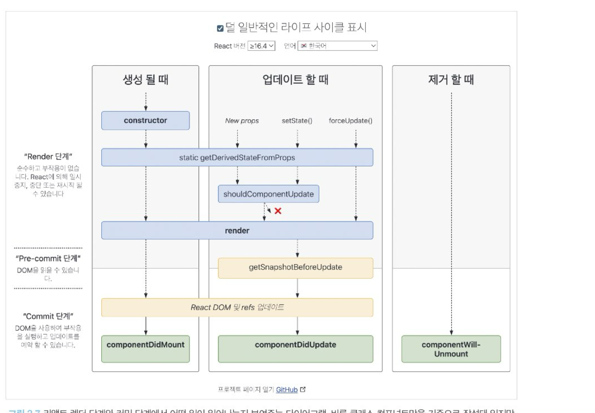

# **2장 리액트 핵심 요소 깊게 살펴보기**

## 2.4 렌더링은 어떻게 일어나는가?
브라우저에서 렌더링이란 쉽게 말해 HTML과 CSS 리소스를 기반으로 웹페이지에 필요한 UI를 그리는 과정을 의미한다.

`리액트의 렌더링`은 브라우저가 렌더링에 필요한 DOM 트리를 만드는 과정을 의미한다. 리액트도 브라우저와 마찬가지로 이 렌더링 작업을 위한 자체적인 렌더링 프로세스가 있으며, 이를 이해하는 것은 곧 리액트를 이해하는 첫걸음으로 볼 수 있다.
### 2.4.1 리액트의 렌더링이란?
리액트 애플리케이션 트리 안에 있는 모든 컴포넌트들이 현재 자신들이 가지고 있는 props와 state 값을 기반으로 어떻게 UI를 구성하고 이를 바탕으로 어떤 DOM 결과를 브라우저에 제공할 것인지 계산하는 일련의 과정을 의미한다.

 

### 2.4.2 리액트의 렌더링이 일어나는 이유 
렌더링이 언제 발생하느냐가 중요하다. 리액트에서 렌더링이 발생하는 시나리오는 다음과 같다.

>1. 최초 렌더링
>2. 리렌더링

이 시나리오에 해당되지 않는 경우, useState 등으로 관리되지 않는 단순한 변수는 제아무리 변경된다 하더라도 리렌더링을 발생시키지 않아 변경된 값을 렌더링된 DOM에서 인할 수 있다.

 

### 2.4.3 리액트의 렌더링 프로세스 
렌더링 프로세스가 시작되면 리액트는 컴포넌트의 루트에서부터 차근차근 아래쪽으로 내려가면서 업데이트가 필요하다고 지정돼 있는 모든 컴포넌트를 찾는다. 그 컴포넌트를 발견하면 클래스 컴포넌트의 경우에는 클래스 내부의 render()함수를 실행하게 되고, 함수 컴포넌트의 경우에는 FunctionComponent() 그 자체를 호출한 뒤에, 그 결과물을 저장한다.

일반적으로 렌더링 결과물은 JSX 문법으로 구성돼 있고, 이것이 자바스크립트로 컴파일되면서 React.createElement()를 호출하는 구문으로 변환된다. 여기서 createElement는 브라우저의 UI구조를 설명할 수 있는 일반적인 자바스크립트 객체를 변환한다.

이런 과정으로 각 컴포넌트의 렌더링 결과물을 수집한 다음, 리액트의 새로운 트리인 가상 DOM과 비교해 실제 DOM에 반영하기 위한 모든 변경 사항을 차례차례 수집한다. 이렇게 계산하는 과정을 바로 `리액트의 재조정`이라고 한다.

이러한 재조정 과정이 모두 끝나면 모든 변경 사항을 하나의 동기 시퀀스로 DOM에 적용해 변경된 결과물이 보이게 된다.

 

### 2.4.4 렌더와 커밋 

렌더 단계(Render Phase)는 컴포넌트를 렌더링하고 변경 사항을 계산하는 모든 작업을 말한다. 즉, 렌덜이 프로세스에서 컴포넌트를 실행해(render() 또는 return) 이 결과와 이전 가상 DOM을 비교하는 가정을 거쳐 변경이 필요한 컴포넌트를 체크하는 단계다. 

여기서 비교하는 것은 크게 세 가지로, `type, props, key` 다. 이 세 가지 중 하나라도 변경된 것이 있으면 변경이 필요한 컴포넌트로 체크해 둔다.

그 다음으로 커밋단계(Commit Phase)는 렌더 단계의 변경 사항을 실제 DOM에 적용해 사용자에게 보여주는 과정을 말한다. 이 단계가 끝나야 비로소 브라우저의 렌더링이 발생한다.

리액트의 렌더링이 일어난다고 해서 무조건 DOM 업데이트가 일어나는 것은 아니다. 렌더링을 수행했으나 커밋 단계까지 갈 필요가 없다면, 즉 변경사항을 계산했는데 아무런 변경 사항이 감지되지 않는다면 이 커밋 단계는 생략될 수 있다.

즉 리액트의 렌더링은 꼭 가시적인 변경이 일어나지 않아도 발생할 수 있다. 렌더링 과정 중 첫 번째 단계인 렌더 단계에서 변경 사항을 감지할 수 없다면 커밋 단계가 생략되어 브라우저의 DOM 업데이트가 일어나지 않을 수 있다.

또한 동시성 렌더링이 리액트 18에서 도입됐다.