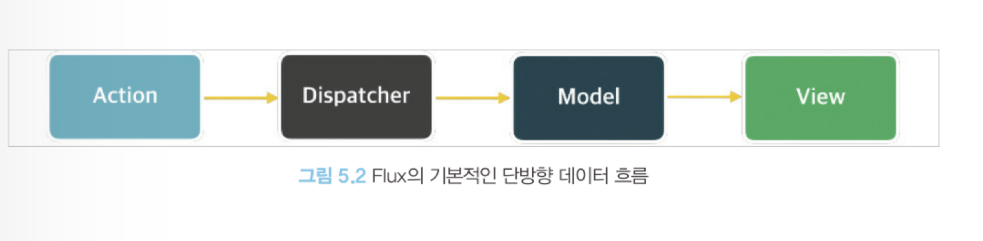
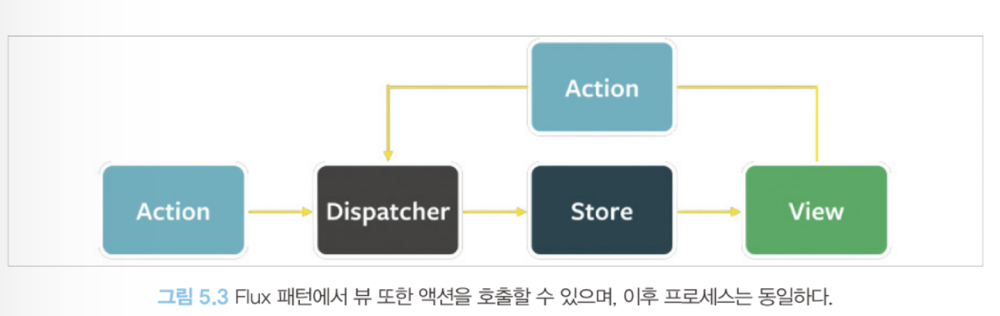

# **5장 리액트와 상태관리 라이브러리**

## 5.1 상태 관리는 왜 필요한가?

웹 애플리케이션을 개발할 때 이야기하는 상태는 어떠한 의미를 지닌 값이며 애플리케이션의 시나리오에 따라 지속적으로 변경될 수 있는 값을 의미한다.

웹 애플리케이션에서 상태로 분류될 수 있는 것들은 대표적으로 다음과 같다.

- UI : 기본적으로 웹 애플리케이션에서 상태라 함은 상호 작용이 가능한 모든 요소의 현재 값을 의미한다. 다크/라이트 모드, 라디오를 비롯한 각종 input, 알림창의 노출 여부 등 많은 종류의 상태가 존재한다.
- URL : 브라우저에서 관리되고 있는 상태값으로, 여기에도 우리가 참고할 만한 상태가 존재할 수 있다. **https://www.airbnb.co.kr/rooms/123?adults=2**와 같은 주소가 있다고 가정해 보자. 이 주소에는 roomId=123과 adults=2라고 하는 상태가 존재하며 이 상태는 사용자의 라우팅에 따라 변경된다.
- 폼(form) : 폼에도 상태가 존재한다. 로딩 중인지(loading), 현재 제출됐는지(submit), 접근이 불가능한지(disabled), 값이 유효한지(validation) 등 모두가 상태로 관리된다.
- 서버에서 가져온 값: 클라이언트에서 서버로 요청을 통해 가져온 값도 상태로 볼 수 있다. 대표적으로 API 요청이 있다.

애플리케이션 전체적으로 관리해야 할 상태가 있다고 가정해 보자. 그리고 그 상태에 따라 다양한 요소들이 각 상태에 맞는 UI를 보여줘야 한다. 상태를 어디에 둘 것인가? 전역 변수에 둘 것인가? 별도의 클로저를 만들 것인가? 그렇다면 그 상태가 유효한 범위는 어떻게 제한할 수 있을까? 상태의 변화에 따라 변경돼야 하는 자식 요소들은 어떻게 이 상태의 변화를 감지할 것인가? 이러한 상태 변화가 일어남에 따라 즉각적으로 모든 요소들이 변경되어 애플리케이션이 찢어지는 현상(이를 tearing이라고 하며, 하나의 상태에 따라 서로 다른 결과물을 사용자에게 보여주는 현상을 말한다.)을 어떻게 방지할 것인가?

이처럼 현대 웹 애플리케이션에서 상태 관리란 어렵다고 해서 외면할 수 없는 주제가 됐다. 이러한 상태를 효율적으로 관리하고, 상태가 필요한 쪽에서는 빠르게 반응할 수 있는 모델에 대한 고민이 본격적으로 시작된 것이다.

### 5.1.1 리액트 상태 관리의 역사
 

### `Flux 패턴의 등장`
예전에는 리액트 애플리케이션에서 딱히 이름을 널리 알린 상태 관리 라이브는 없었다.

2014년경, 리액트의 등장과 비슷한 시기에 Flux 패턴과 함께 이를 기반으로한 라이브러리인 Flux를 소개하게 된다. 이 당시에는 웹 애플리케이션이 비대해지고 상태(데이터)도 많아짐에 따라 어디서 어떤 일이 일어나서 이 상태가 변했는지 등을 추적하고 이해하기가 매우 어려웠다.

페이스북 팀은 이러한 문제의 원인을 **양방향 데이터 바인딩**으로 봤다. 뷰(HTML)가 모델(자바스크립트)을 변경할 수 있으며, 반대의 경우 모델도 뷰를 변경할 수 있다. 이는 코드를 작성하는 입장에서는 간단할 수 있지만 코드의 양이 많아지고 변경 시나리오가 복잡해질수록 관리가 어려워진다.

페이스북 팀은 양방향이 아닌 **단방향으로 데이터 흐름을 변경하는 것을 제안**하는데 이것이 바로 **Flux 패턴의 시작**이다.

- 액션(action) : 어떠한 작업을 처리할 액션과 그 액션 발생 시 함께 포함시킬 데이터를 의미한다. 액션 타입과 데이터를 각각 정의해 이를 디스패처로 보낸다.
- 디스패처(dispatcher) : 액션을 스토어에 보내는 역할을 한다. 콜백 함수 형태로 앞서 액션이 정의한 타입과 데이터를 모두 스토어에 보낸다
- 스토어(store) : 여기에서 실제 상태에 따른 값과 상태를 변경할 수 있는 메서드를 가지고 있다. 액션의 타입에 따라 어떻게 이를 변경할지가 정의돼 있다. (=useReducer, reducer)
- 뷰(view) : 리액트의 컴포넌트에 해당하는 부분으로, 스토어에서 만들어진 데이터를 가져와 화면을 렌더링하는 역할을 한다. 또한 뷰에서도 사용자의 입력이나 행위에 따라 상태를 업데이트하고자 할 수 있을 것이다. 이 경우에는 다음 그림처럼 뷰에서 액션을 호출하는 구조로 구성된다. (=App())

이러한 단방향 데이터 흐름 방식은 당연히 불편함도 존한다. 사용자의 입력에 따라(여기에서는 사용자의 클릭에 따라) 데이터를 갱신하고 화면을 어떻게 업데이트해야 하는지도 코드로 작성해야 하므로 코의 양이 많아지고 개발자도 수고로워진다.

그러나 데이터의 흐름은 모두 액션이라는 한 방향(단방향)으로 줄어들므로 데이터의 흐름을 추적하기 쉽고 코드를 이해하기가 한결 수월해진다. 리액트는 대표적인 단방향 데이터 바인딩을 기반으로 한 라이브러리였으므로 이러한 단방향 흐름을 정의하는 Flux 패턴과 매우 궁합이 잘맞았다.

 

### `시장 지배자 리덕스의 등장`

리덕스 또한 최초에는 이 Flux 구조를 구현하기 위해 만들어진 라이브러리 중 하나였다. 이에 한 가지 더 특별한 것은 여기에 Elm 아키텍처를 도입했다는 것이다. `Elm`은 웹페이지를 선언적으로 작성하기 위한 언어다.

Elm 아키텍처의 핵심은 아래 세 가지와 같다.

- 모델(model) : 애플리케이션의 상태를 의미한다. 여기서는 Model을 의미하며, 초깃값으로는 0이 주어졌다.
- 뷰(view) : 모델을 표현하는 HTML을 말한다. 여기서는 Model을 인수로 받아서 HTML을 표현한다.
- 업데이트(update) : 모델을 수정하는 방식을 말한다. Increment, Decrement를 선언해 각각의 방식이 어떻게 모델을 수정하는지 나타냈다.

즉, Elm은 Flux와 마찬가지로 데이터 흐름을 세 가지로 분류하고, 이를 단방향으로 강제해 웹 애플리케이션의 상태를 안정적으로 관리하고자 노력했다. 그리고 리덕스는 이 Elm 아키텍처의 영향을 받아 작성됐다.

리덕스는 하나의 상태 객체를 스토어에 저장해 두고, 이 객체를 업데이트하는 작업을 디스패치해 업데이트를 수행한다. 이러한 작업은 reducer함수로 발생시킬 수 있는데, 이 함수의 실행은 웹 애플리케이션 상태에 대한 완전히 새로운 복사본을 반환한 다음, 애플리케이션에 이 새롭게 만들어진 상태를 전파하게 된다.

이러한 리덕스의 등장은 리액트 생태계에 많은 영향을 미치게 됐다. 하나의 글로벌 상태 객체를 통해 이 상태를 하위 컴포넌트에 전파할 수 있기 때문에 props를 깊이 전파해야 하는 이른바 prop 내려주기 문제를 해결할 수 있었고, 스토어가 필요한 컴포넌트라면 단지 connect만 쓰면 스토어에 바로 접근할 수 있었다.

하지만 하고자 하는 일에 비해 보일러플레이트가 너무 많다는 비판의 목소리가 있었다. 이는 리덕스가 처음 등장했을 때 받던 비판으로, 지금은 이러한 작업이 많이 간소화됐다.

 

### `Context API와 useContext`

리액트 팀은 리액트 16.3에서 전역 상태를 하위 컴포넌트에 주입할 수 있는 새로운 Context API를 출시했다. props로 상태를 넘겨주지 않더라도 Context API를 사용하면 원하는 곳에서 Context Provider가 주입하는 상태를 사용할 수 있게 된 것이다.

앞서 언급한 prop 내려주기, 즉 원하는 값을 props로 번거롭게 넘겨주지 않아도 사용 가능해진 것이다.

그러나 Context API는 상태 관리가 아닌 **주입을 도와주는 기능**이며, 렌더링을 막아주는 기능 또한 존재하지 않으니 사용할 때 주의가 필요하다.

 

### `훅의 탄생, 그리고 React Query와 SWR`

이전에는 볼 수 없던 방식의 상태 관리가 등장하는데 바로 **React Query와 SWR**이다. 

두 라이브러리는 모두 외부에서 데이터를 불러오는 fetch를 관리하는 데 특화된 라이브러리지만, API 호출에 대한 상태를 관리하고 있기 때문에 HTTP 요청에 특화된 상태 관리 라이브러리라 볼 수 있다.

useSWR의 첫 번째 인수로 조회할 API 주소를, 두 번째 인수로 조회에 사용되는 fetch를 넘겨준다. 첫 번째 인수인 API 주소는 키로도 사용되며, 이후에 다른 곳에서 동일한 키로 호출하면 재조회하는 것이 아니라 useSWR이 관리하고 있는 캐시의 값을 활용한다.

 

### `Recoil, Zustnad, Jotai, Valtio에 이르기까지`

훅이라는 새로운 패러다임의 등장에 따라, 훅을 활용해 상태를 가져오거나 관리할 수 있는 다양한 라이브러리가 등장하게 된다. 페이스북 팀에서 만든 Recoil을 필두로, Jotai, Zustand, Valtio 등 다양한 라이브러리가 선보이게 된다.

요즘 새롭게 떠오르고 많은 상태 관리 라이브러리는 기존의 리덕스 같은 라이브러리와는 차이점이 있는데, 바로 `훅을 활용해` 작은 크기의 상태를 효율적으로 관리한다는 것이다.

이는 기존 상태 관리 라이브러리의 아쉬운 점으로 지적받던 전역 상태 관리 패러다임에서 벗어나 개발자가 원하는 만큼의 상태를 지역적으로 관리하는 것을 가능하게 만들었고, 훅을 지원함으로써 함수 컴포넌트에서 손쉽게 사용할 수 있다는 장점 또한 가지고 있다.