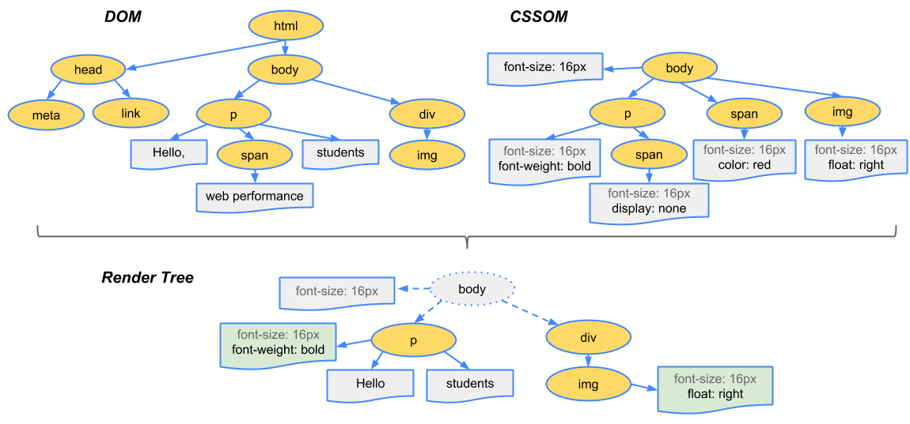

### 목차

- [2.2 가상 DOM 과 리액트 파이버](#22-가상-dom-과-리액트-파이버)
  - [2.2.1 DOM과 브라우저 렌더링 과정](#221-dom과-브라우저-렌더링-과정)
    - [DOM 이란?](#dom-이란)
    - [DOM 렌더링 과정](#dom-렌더링-과정)
  - [2.2.2 가상 DOM 의 탄생 배경](#222-가상-dom-의-탄생-배경)
    - [가상 DOM 탄생 배경](#가상-dom-탄생-배경)
    - [가상 DOM](#가상-dom)
  - [2.2.3 가상 DOM을 위한 아키텍쳐, 리액트 파이버](#223-가상-dom을-위한-아키텍쳐-리액트-파이버)
    - [리액트 파이버란 ?](#리액트-파이버란-)
    - [리액트 파이버 구현 요소](#리액트-파이버-구현-요소)
    - [파이버 파헤치기](#파이버-파헤치기)
    - [파이버의 구조 예시](#파이버의-구조-예시)
    - [리액트 파이버 트리](#리액트-파이버-트리)
    - [파이버의 작업 순서](#파이버의-작업-순서)
  - [2.2.4 파이버와 가상 DOM](#224-파이버와-가상-dom)
  - [2.2.5 정리](#225-정리)

# 2.2 가상 DOM 과 리액트 파이버

- React는 `가상 DOM` 을 운영하는 것이 가장 큰 특징이다.

## 2.2.1 DOM과 브라우저 렌더링 과정

### DOM 이란?

- 웹페이지에 대한 인터페이스
- 브라우저가 웹 페이지의 콘텐츠와 구조를 어떻게 보여줄지에 대한 정보를 담는다.

### DOM 렌더링 과정

1. 브라우저가 사용자가 요청한 주소 (URL) 을 방문해 HTML 파일을 다운로드 한다.
2. 브라우저의 `렌더링 엔진` 은 HTML 을 파싱하여 `DOM 노드` 로 구성된 트리 (DOM) 을 만든다.
3. (2) 번 과정에서 CSS 파일을 만나면, 해당 CSS 파일도 다운로드 한다.
4. 브라우저의 렌더링 엔진은 이 CSS 도 파싱하여 `CSS 노드` 로 구성 된 트리 (CSSOM) 을 만든다.
5. 브라우저가 (2)번에서 만든 `DOM 노드` 를 순회 한다.
   - 사용자 눈에 보이는 노드만 방문
   - 사용자 화면에 보이지 않는 요소는 방문하지 않는다.
   - 트리를 분석하는 과정을 빠르게 하기 위함
6. (5) 에서 제외한 노드 말고, 눈에 보이는 노드를 대상으로 CSSOM 정보를 찾는다.
   - 찾은 CSS 스타일 정보를 해당 노드에 적용
     - `레이아웃 (Layout)`
       - 각 노드가 브라우저 화면의 어느 좌표에 나타나야하는지 계산하는 과정
       - 레이아웃 과정을 거치면 페인팅 과정도 필히 거치게 된다.
     - `페인팅 (painting)`
       - 레이아웃 단계를 거친 노드에 색(color) 와 같은 실제 유효한 모습을 그리는 과정

- 자세한 이해를 위한 참고 글 : https://so-so.dev/web/browser-rendering-process/
  

## 2.2.2 가상 DOM 의 탄생 배경

- 브라우저가 웹페이지를 렌더링 하는 과정은 매우 복잡하고 많은 비용이 든다.
  - 성능최적화가 필요한 이유
- 렌더링이 완료된 이후에도 사용자의 인터랙션으로 웹페이지가 변경되는 상황을 고려해야 한다.

### 가상 DOM 탄생 배경

- 하나의 인터랙션으로 인해 페이지 내부의 DOM의 여러가지 부분이 변경되는 경우는 요즘 웹페이지에서 매우 흔하다.
- 개발자는 인터랙션으로 인한 모든 DOM 의 변경사항 보다, 결과적으로 만들어지는 DOM 결과물 하나만 알고싶다.
- 이러한 이유로 가상 DOM 이 탄생하였다.

### 가상 DOM

- 실제 브라우저가 아닌 React 가 관리하는 가상의 DOM 을 의미
- 가상 DOM은 웹페이지가 표시해야할 DOM을 메모리에 저장한다.
  - 이후, React가 `실제 변경` 에 대한 준비가 완료됐을 때, 실제 브라우저의 DOM에 반영
  - react-dom 이 이 역할을 수행한다.
- 가상 DOM 의 방식이 무조건 일반적인 DOM 관리 방식보다 빠르다고 할 수 는 없다.
  - 대부분의 상황에서 웬만한 애플리케이션을 만들 수 있을 정도로 빠르다는것

## 2.2.3 가상 DOM을 위한 아키텍쳐, 리액트 파이버

- React Fiber : 가상 DOM과정 최적화를 가능하게 해주는 아키텍쳐

### 리액트 파이버란 ?

- React 에서 관리하는 평번한 JS 객체 이다.
- 파이버는 `파이버 재조정자 (fiber reconciler)` 가 관리
  - 가상 DOM과 실제 DOM을 비교해 변경사항 수집
  - 변경에 관련된 정보를 가지고 있는 파이버를 기준으로 화면에 렌더링 요청
- 어떤 부분을 새롭게 렌더링 해야하는지, 가상 DOM과 실제 DOM의 비교하는 작업을 수행한다.
- 리액트 파이버의 목표
  - Web Application 에서 발생하는 애니메이션, 레이아웃, 사용자 인터랙션에 올바른 결과물을 만드는 `반응성 문제` 를 해결하는 것
  - 작업을 작은 단위로 분할하고, `우선순위를 매긴다`
  - 위의 작업은 `일시중지` 하고 나중에 다시 시작할 수 있다.
  - 이전에 했던 작업을 다시 재사용하거나 필요하지 않은 경우 폐기할 수 있다.
    - `위의 모든 과정은 비동기로 일어난다`

### 리액트 파이버 구현 요소

- 하나의 작업단위 (Task) 로 구성되어 있다.
  - React는 작업단위를 하나씩 처리하고 `finishedWork()` 라는 작업으로 작업을 마무리
  - 이 작업을 commit 하여 실제 브라우저 DOM 에 가시적인 변경사항을 만들어 낸다.
    1. 렌더단계에서 React는 사용자에게 노출되지 않은 모든 `비동기` 작업을 수행한다.
       - 파이버의 작업, 우선순위를 지정하거나 중지, 폐기하는 작업이 발생
    2. commit 단계에서는 DOM에 실제 변경사항을 반영하기 위한 `commitWork()` 가 실행 된다.
       - 동기식으로 일어나며 중단이 불가능하다.

### 파이버 파헤치기

- React 요소는 렌더링이 발생 할 때 마다 새롭게 생성된다.
- 위와 반대로 파이버는 가급적 `재사용` 된다.
  - 컴포넌트가 최초 Mount 되는 시점에 생성되어 가급적 재사용 된다.
- React의 ReactFiber.js 코드 : https://github.com/facebook/react/blob/main/packages/react-reconciler/src/ReactFiber.js

> 파이버는 state가 변경되거나 생명주기 메서드가 실행 되거나 DOM의 변경이 필요한 시점에 실행 된다.

- 리액트가 파이버를 처리할 때는 작업단위로 나누어 처리하며, 중지, 바로 처리, 스케줄링이 가능하다.

```jsx
// react/packages/react-reconciler/src/ReactFiber.js

function createFiber(
  tag: WorkTag,
  pendingProps: mixed,
  key: null | string,
  mode: TypeOfMode
): Fiber {
  // $FlowFixMe[invalid-constructor]: the shapes are exact here but Flow doesn't like constructors
  return new FiberNode(tag, pendingProps, key, mode);
}
```

- `tag`
  - 파이버는 하나의 Element 에 하나가 생성되는 1 : 1 관계를 가진다.
  - 1 : 1 매칭된 정보를 가지고 있는 것이 `tag` 이다.
- `stateNode`
  - 파이버 자체에 대한 참조(reference) 정보를 가지고 있다.
  - 참조 정보를 바탕으로 React는 파이버와 관련된 상태에 접근한다.
- `child, sibling, return`
  - 파이버 간의 관계 개념을 나타내는 속성
  - 파이버도 리액트 컴포넌트 트리처럼 트리형식을 갖는다.
    - 리액트와 다른점은 children이 없고 child만 존재

### 파이버의 구조 예시

```html
<ul>
  <li>하나</li>
  <li>둘</li>
  <li>셋</li>
</ul>
```

- 위의 코드를 js 코드로 관계도를 작성해보면 아래와 같다.

```jsx
const l3 = {
  return: ul,
  index: 2,
};

const l2 = {
  sibling: l3,
  return: ul,
  index: 1,
};

const l1 = {
  sibling: l2,
  return: ul,
  index: 0,
};

const ul = {
  //...
  child: l1,
};
```

- 파이버의 자식은 항상 첫 번째 자식의 참조로 구성된다.
  - 나머지 요소는 형제 (sibling) 로 구성 된다.
- `index`
  - 형제들 사이 자신의 위치가 몇번째인지 숫자로 표현한다.
- `pendingProps`
  - 아직 작업을 미처 처리하지 못한 props
- `memorizedProps`
  - pendingProps를 기준으로 렌더링이 완료된 이후에 pendingProps를 memorizedProps로 저장해 관리한다.
- `updateQueue`
  - 상태 업데이트, 콜백 함수, DOM 업데이트 등 필요한 작업을 담아두는 큐
- `memorizedState`
  - 함수 컴포넌트의 hook 목록이 저장되는 곳
  - useState 뿐만 아니라 다른 모든 hook 리스트가 저장된다.
- `alternate`
  - 리액트의 트리 두개중 하나

### 리액트 파이버 트리

- 파이버 트리는 리액트 내부에서 두 개가 존재한다.
  - 현재의 모습을 담은 파이버 트리
  - 작업중인 상태를 나타내는 트리 (`workinProgress`)

> 리액트 파이버는 작업이 끝나면 포인터만 변경하여 workInProgress 트리를 현재 상태 트리로 변경해 버린다. ⇒ `더블 버퍼링`

### 파이버의 작업 순서

1. 리액트가 `beginWork()` 함수를 실행하여 파이버 작업을 수행
   - 자식이 없는 파이버를 만날 때 까지 `트리형식` 으로 시작
2. (1) 에서 작업이 끝나면 그 다음 `completeWork()` 함수를 실행해 파이버 작업을 완료
3. 형제 요소가 있다면 형제로 넘어간다.
4. (2), (3) 모두 끝나면 `return` 으로 돌아가 작업이 완료되었음을 알린다.
5. 모든 작업이 끝나면 `commitWork()` 가 수행된다.
   - 변경사항을 비교하여 업데이트가 필요한 변경사항이 DOM에 반영된다.

- 리액트 파이버는 앞서 설명한 것처럼 `작업단위` 로 수행되며 `비동기적` 으로 수행된다.
- 우선순위가 높은 다른 업데이트가 오면 수행중인 작업을 일시중단 하거나, 새롭게 만들거나 폐기할 수 있다.
- 작업단위를 나누어서 우선순위를 할당하는 것 또한 가능하다.
- 나누어둔 우선순위를 파악하여 최적의 순위로 작업을 수행한다.
  - 우선순위 높은 작업
    - 사용자 인터랙션, 애니메이션 등
  - 우선순위 낮은 작업
    - 목록 렌더링, 단순 요소 렌더링 등

## 2.2.4 파이버와 가상 DOM

- 파이버는 리액트 컴포넌트에 대한 정보를 `1 : 1` 로 가지고 있으며, 리액트 아키텍쳐 내부에서 `비동기` 로 이뤄진다.
- 실제 브라우저 구조인 DOM 반영하는 작업은 `동기적` 으로 수행 되어야 한다.
  - 작업량이 많으면 표현에 누락이 있을 수 있으므로 `메모리상` 에서 먼저 수행한다.
  - 메모리에서 파이버 작업을 수행한 `최종 결과물` 만 실제 브라우저 DOM에 적용한다.
- 가상 DOM 은 웹 애플리케이션에서만 통용된다.
- 가상DOM과 리액트 파이버는 다른 개념이다.

## 2.2.5 정리

- 리액트 내부의 파이버와 재조정자가 내부저긴 알고리즘을 통해 DOM 을 관리하기 때문에 웹 애플리케이션을 효율적으로 유지보수 및 관리를 할 수 있는것이다.
- 가상 DOM 과 리액트의 핵심은 브라우저의 렌더링을 빠르게 하는것이 아니다.
  - 핵심은 `값으로 UI 를 표현하는것이다`
  - 표시되는 UI를 JS의 문자열, 배열등과 같은 값을 관리함이 리액트의 핵심이다.
