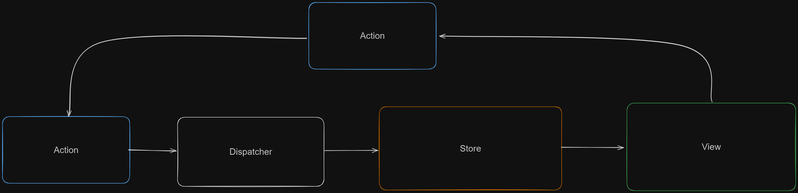

### 목차

- [5-1 상태 관리는 왜 필요한가?](#5-1-상태-관리는-왜-필요한가)
    - [웹 애플리케이션에서 `상태` 로 분류 될 수 있는 것](#웹-애플리케이션에서-상태-로-분류-될-수-있는-것)
  - [5.1.1 리액트 상태 관리의 역사](#511-리액트-상태-관리의-역사)
    - [Flux 패턴의 등장](#flux-패턴의-등장)
    - [시장 지배자 Redux의 등장](#시장-지배자-redux의-등장)
    - [Context API 와 useContext](#context-api-와-usecontext)
    - [훅의 탄생, 그리고 React Query와 SWR](#훅의-탄생-그리고-react-query와-swr)
    - [Recoil, Zustand, Jotai, Valtio에 이르기까지](#recoil-zustand-jotai-valtio에-이르기까지)
  - [5.1.2 정리](#512-정리)

# 5-1 상태 관리는 왜 필요한가?

### 웹 애플리케이션에서 `상태` 로 분류 될 수 있는 것

- UI
- URL
- Form
- 서버에서 가져온 값

## 5.1.1 리액트 상태 관리의 역사

### Flux 패턴의 등장

- 기존 MVC 패턴은 모델과 뷰가 많아질수록 복잡도가 증가했다.
- 페이스북 팀이 이러한 문제의 원인을 `양방향 데이터 바인딩` 으로 판단했다.
- Flux 패턴의 데이터 흐름

  - Action → Dispatcher → Model → View
  - action : 어떠한 작업을 처리할 액션과, 액션 발생 시 함께 포함시킬 데이터를 의미
  - dispatcher : action을 스토어에 보내는 역할을 한다.
  - store : 실제 상탱 ㅔ따른 값과, 상태를 변경할 수 있는 메서드를 가지고 있다.
  - view : 리액트의 컴포넌트에 해당하는 부분, 스토어에서 만들어진 데이터를 가져와 화면을 렌더링하는 역할을 한다.

    

- 단방향 데이터 흐름의 장단점
  - 장점
    - 데이터의 흐름이 Action으로 줄어듦으로 데이터의 흐름을 추적하기 쉽고, 코드를 이해하기 수월해진다.
  - 단점
    - 데이터를 갱신하고 화면을 어떻게 업데이트 해야 하는지도 코드로 작성해 하므로 코드의 양이 많아진다.

### 시장 지배자 Redux의 등장

- Flux 구조를 가지면서 `Elm` 아키텍쳐가 같이 도입된 라이브러리
- Elm : 웹페이지를 선언적으로 작성하기 위한 언어

  - Elm은 Flux와 마찬가지로 데이터 흐름을 세가지(Model, View, Update)로 분류하였음
  - 데이터 흐름을 `단방향` 으로 강제한다.

- Redux 간단 설명
  - 하나의 상태객체를 Store에 저장해둔다.
  - 상태객체를 업데이트 하는 작업을 디스패치해 업데이트를 수행한다.
    - 이러한 작업을 reducer함수로 발생 시킨다.
      - 웹 상태에 대한 완전히 새로운 복사본을 반환한 다음, 애플리케이션에 새로운 상태를 전파한다.
  - 글로벌 상태를 통해 상위 컴포넌트의 상태를 하위 컴포넌트에 전달할 수 있다 (Props Drilling 방지)
  - 단순히 하나의 상태를 바꾸고 싶어도 작업해야할 양이 많음
    - action type 선언
    - creator 함수 작성
    - dispatcher, selector 작성
    - reducer 내부 구성

### Context API 와 useContext

- 리액트 팀이 16.3 버전에서 전역 상태를 하위 컴포넌트에 `주입` 할 수 있는 ContextAPI를 출시
- Props를 넘겨주지 않아도, Context API 사용을 원하는 곳에서 Context Provider주입하는 상태 사용 가능
- 상태 관리가 아닌 `상태 주입` 을 도와주기 위한 기능
- 렌더링을 막아주는 기능이 없으니 사용할 때 주의가 필요하다.

### 훅의 탄생, 그리고 React Query와 SWR

- 두 라이브러리 모두 외부에서 데이터를 불러오는 fetch를 관리하는데 특화되어 있다.

  - HTTP 요청에 특화된 상태 관리 라이브러리이다.

- SWR 간단 예시 코드

  ```jsx
  import React from "react";
  import useSWR from "swr";

  const fetcher = (url) => fetch(url).then((res) => res.json());

  export default function App() {
    const { data, error } = useSWR("http://url주소", fetcher);

    if (error) return "fetcher 결과 에러 발생";
    if (!error) return "Loading...";

    return (
      <div>
        <p>{JSON.stringify(data)}</p>
      </div>
    );
  }
  ```

  - uswSWR 은 조회할 API 주소와 조회에 사용되는 fetch를 넘겨준다.
  - 첫번째 인수인 url은 key 로 사용되며, 이후에 다른 곳에서 동일한 ket로 호출하면 fetch로 재조회 하는 것이 아닌 useSWR이 관리하고 있는 `캐시` 의 값을 활용한다.

### Recoil, Zustand, Jotai, Valtio에 이르기까지

- Hook을 활용해 상태를 가져오거나 관리할 수 있는 다양한 라이브러리가 등장
  - Recoil (메타), Jotai, Zustand, Valtio 등
  - 전역 상태 관리 패러다임에서 개발자가 원하는만큼의 상태를 지역적으로 관리하는 것을 가능하게 한다.
  - hook을 지원하여 함수 컴포넌트에서 손쉽게 사용할 수 있다.
- 각 라이브러리 별 상태 관리 예시 코드

  ```jsx
  // Recoil
  const counter = atom({key : "count", default : 0})
  const todoList = useRecoilValue(counter)

  // Jotai
  const countAtom = atom(0)
  const [count, setCount] = useAtom(countAtom)

  // Zustand
  const useCounterStore = create((set) => {
  	count : 0,
  	increase : () => set((state) => ({count : state.count + 1}))
  })
  const count = useCounterStore(state => state.count)

  // Valtio
  const state = proxy({count : 0})
  const snap = useSnapshot(state)
  state.count++
  ```

  - 위의 라이브러리 들은 hook을 활용해 작은 크기의 상태를 효율적으로 관리한다.
    - Redux와의 차이점

## 5.1.2 정리

- 리액트 생태계에는 상태관리에 대한 고민과 솔루션이 끊임없이 나오고 있다.
- 다양한 옵션을 살펴보고 비교하면서 라이브러리를 채택하는 것이 좋은 방법이다.
