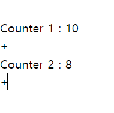

- [5.2 리액트 훅으로 시작하는 상태 관리](#52-리액트-훅으로-시작하는-상태-관리)
  - [5.2.1 가장 기본적인 방법 : useState와 useReducer](#521-가장-기본적인-방법--usestate와-usereducer)
  - [5.2.2 지역 상태의 한계 벗어나기 : useState를 바깥으로 분리하기](#522-지역-상태의-한계-벗어나기--usestate를-바깥으로-분리하기)
  - [5.2.3 useState와 useContext를 동시에 사용해보기](#523-usestate와-usecontext를-동시에-사용해보기)
  - [5.2.4 상태 관리 라이브러리 Recoil, Jotai, Zustand 살펴보기](#524-상태-관리-라이브러리-recoil-jotai-zustand-살펴보기)
    - [페이스북의 Recoil](#페이스북의-recoil)
    - [Recoil에서 영감을 받은, 그러나 조금 더 유연한 Jotai](#recoil에서-영감을-받은-그러나-조금-더-유연한-jotai)
    - [작고 빠르며 확장에도 유연한 Zustand](#작고-빠르며-확장에도-유연한-zustand)
  - [5.2.5 정리](#525-정리)

# 5.2 리액트 훅으로 시작하는 상태 관리

- 오랜기간 리액트 생태계는 redux에 의존했다.
- 현재는 새로운 Context API, useReducer, useState 의 등장으로 좋은 상태 관리 방법들이 등장
  - redux외의 다른 상태관리 라이브러리에 대한 채택률도 높아지고 있다.

## 5.2.1 가장 기본적인 방법 : useState와 useReducer

- useState의 등장

  - 여러 컴포넌트에 걸쳐 손쉽게 동일한 인터페이스의 상태를 생성 및 관리할 수 있게 됐다.

  ```tsx
  function useCounter(initialCount: number = 0) {
    const [count, setCount] = useState(initialCount);

    function inc() {
      setCounter((prev) => prev + 1);
    }

    return { count, inc };
  }
  ```

  - 함수 컴포넌트 어디에서든 사용가능한 커스텀훅을 구현 할 수 있다.
  - 상태값과 해당 상태를 조작하는 함수를 같이 반환하여, 다른 컴포넌트 함수에서 해당 상태에 접근 하고 조작할 수 있다.

  ```tsx
  function useCounter (initCount : number =0) {
    const [count, setCount] = useState(initCount);

    function inc() {
      setCount(prevCount => prevCount + 1)
    }

    return {count, inc}
  }

  function Counter1() {
    const {count, inc} = useCounter();
    return(
      <>
      <h3>Counter 1 : {count}</h3>
      <button onClick={inc}>+</button>
      </>
    )
  }

  function Counter2() {
    const {count,inc}= useCounter()
    return(
      <>
      <h3>Counter 2 : {count}</h3>
      <button onClick={inc}>+</button>
      </>
    )
  }

  export default App() {
  	return(
  		<>
  			<Counter1 />
  			<Counter2 />
  		</>
  	)
  }
  ```

  

  - 같은 Custom Hook을 사용하지만 state는 해당 함수 컴포넌트에만 영향을 끼친다.

- useState와 useReducer 는 `지역 상태 관리` 를 위해 만들어졌다.
- 다만 useState는 상태의 지역화를 통해 여러개의 컴포넌트에서 한개의 상태를 동일하게 사용하기 위해 필히 props를 이용해야하는 불편함이 존재 한다.

## 5.2.2 지역 상태의 한계 벗어나기 : useState를 바깥으로 분리하기

- useState는 리액트가 만든 `클로저` 내부에서 관리되어 지역상태로 생성되기 때문에 해당 컴포넌트에서만 사용 할 수 있다는 단점이 있다.
- useState를 컴포넌트 바깥에 정의하여 바라보게 하는것은 능사가 아니다.
  - useState로 컴포넌트의 리렌더링을 실행해 최신값을 가져오는 방법은 어디까지나 해당 컴포넌트 자체에서만 유효한 전략이다.
- 함수 컴포넌트 외부에서 상태를 참조하고 렌더링까지 하기 위해 생각해볼만한 제약 조건
  1. 컴포넌트 외부에 상태를 두고 여러 컴포넌트가 같이 쓸 수 있어야 한다.
  2. 외부 상태를 이용하는 컴포넌트는 상태의 변화를 감지할 수 있어야 한다.
     - 상태가 변할 때마다 리렌더링이 일어나서 컴포넌트가 최신 상태를 기준으로 렌더링 해야 한다.
  3. 상태가 원시값이 아닌 객체인 경우에 해당 객체에 내가 감지하지 않는 것이 변한다 해도 리렌더링이 일어나지 않아야 한다.

위의 조건에 맞게 컴포넌트 레벨의 지역상태를 벗어나는 새로운 상태 관리 코드를 만들어보자.

- 상태는 객체일수도, 원시값일 수도 있다.
  - ⇒ store라는 이름으로 상태를 저장하는 부분을 구성 한다.
- store의 값이 변경 될 때마다, 변경됐음을 알리는 callback 함수를 실행한다.
- callback을 등록할 수 있는 subscribe 함수를 구성한다.

```tsx
type State = { counter: number };
type Initializer<T> = T extends any ? T | ((prev: T) => T) : never;

type Store<State> = {
  get: () => State; // 항상 최신값을 가져온다.
  set: (action: Initializer<State>) => State; // 값 또는 함수를 받아올 수 있다.
  subscribe: (callback: () => void) => void; // store의 변경을 감지하고, 컴포넌트들이 자신의 callback을 등록한다.
};

/**
 * Store를 참조하는 컴포넌트는 subscribe에
 * 컴포넌트 자기 자신을 렌더링 하는 코드를 추가하여
 * 컴포넌트가 리렌더링을 실행 할 수 있게 해야 한다.
 */

export const createStore = <State extends unknown>(
  initialState: Initializer<State>
): Store<State> => {
  /**
   * useState와 마찬가지로 초깃값을 게으른 초기화를 위한 함수
   * 또는 그냥 값을 받을 수 있도록 한다.
   * state의 값은 Store 내부에서 보관해야 하므로 변수로 사용
   */
  let state =
    typeof initialState !== "function" ? initialState : initialState();

  // callbacks 는 자료형에 관계없이 중복값이 없는 Set 을 사용
  const callbacks = new Set<() => void>();

  // get은 호출시 항상 최신값을 가져올수 있도록 한다.
  const get = () => state;
  const set = (nextState: State | ((prev: State) => State)) => {
    state =
      typeof nextState === "function"
        ? //set의 인수가 함수라면 함수를 실행해 새로운 값을 받고
          // 일반 값이라면 새로운 값을 그대로 사용한다.
          (nextState as (prev: State) => State)(state)
        : nextState;

    // state 값의 설정이 발생 했을 때, callback 목록을 순회하며 모든 callback 실행
    callbacks.forEach((callback) => callback());

    return state;
  };

  // subscribe는 콜백을 인수로 허용
  const subscribe = (callback: () => void) => {
    // 받은 함수를 callback 목록에 추가
    callbacks.add(callback);
    // 클린업 실행 시, 이를 삭제해 반복적으로 callback이 추가되는 것을 막는다.
    return () => {
      callbacks.delete(callback);
    };
  };
  return { get, set, subscribe };
};
```

1. store의 초깃값을 state 또는 Lazy Initialization함수를 받아 store의 기본값을 초기화 하게 한다.
2. (1) 번에서 받은 인수를 바탕으로 함수를 실행하거나 초깃값 자체를 할당해 state초깃값 할당
3. 컴포넌트로 넘겨받는 콜백 함수를 저장하기 위해 callbacks를 Set으로 선언
   - Set은 중복을 허용하지 않는 자료구조
4. get 을 `함수` 로 만들어 매번 최신 state 값을 가져올 수 있게 한다.
5. set 을 만들어 새로운 값을 넣을 수 있도록 만든다.
   - 함수 또는 일반값을 받을 수도 있다.
   - 값을 설정한 후에 callbacks를 순회해 모든 callback을 실행한다.
     - 컴포넌트의 렌더링을 유도한다.
6. subscribe는 callbacks Set에 callback을 등록할 수 있는 함수다.
7. get, set, subscribe를 하나의 객체로 반환해 외부에서 사용할 수 있도록 한다.

위의 createStore 로 만들어진 Store 값을 참조하고, 해당 값의 변화에 따라 컴포넌트 렌더링을 유도할 사용자 정의 hook또한 작성한다.

```tsx
export const useStore = <State extends unknown>(store: Store<State>) => {
  const [state, setState] = useState<State>(() => store.get());

  useEffect(() => {
    const unsubscribe = store.subscribe(() => {
      setState(store.get());
    });

    return unsubscribe;
  }, [store]);
  return [state, store.set] as const;
};
```

1. hook 의 인수로 사용할 store를 받는다.
2. store의 초깃값으로 하는 useState를 만든다.
   - 이 useState가 컴포넌트의 렌더링을 유도한다.
3. useEffect 는 store의 현재 값을 가져와 setState를 수행하는 함수를 store의 subscribe로 등록해두었다.
   - createStore내부에서 값이 변경될 때마다 subscribe에 등록된 함수를 실행
   - useStore내부에서 store의 값이 변경될 때 마다 state 의 변경을 보장받는다.
4. useEffect의 클린업 함수로 unsubscribe를 등록해둔다.
   - useEffect의 작동이 끝난 이후에는 callback에서 해당 함수를 제거해 callback이 계속 쌓이는 현상을 방지한다.

지금까지 작성한 코드는 store의 구조가 원시값일 때 유용하지만 객체일 때는 유효하지 않다.

useStore에서 객체의 일부 값만 변하였을 때, 현재는 무조건 리렌더링이 일어나지만,

원하는 값이 변경되었을 때만 리렌더링 되도록 코드를 수정해 보자.

```tsx
// 기존 useStore 훅
export const useStoreSelector = <State extends unknown, Value extends unknown>(
  store: Store<State>,
  selector: (state: State) => Value
) => {
  const [state, setState] = useState(() => selector(store.get()));

  useEffect(() => {
    const unsubscribe = store.subscribe(() => {
      const value = selector(store.get());
      setState(value);
    });

    return unsubscribe;
  }, [store, selector]);
  return state;
};
```

- 두번째 인수로 selector를 받는 함수로 변경하였다.
- store의 상태에서 어떤 값을 가져올지 정의하는 함수
  - selector(store.get()) 이 변경되지 않는다면, 리렌더링이 일어나지 않는다.

위의 방식으로 구현된 리액트의 자체 hook은 `useSubscription` 이다.

```tsx
export const useStoreSelector = <State extends unknown, Value extends unknown>(
  store : Store<State>,
  selector : (state : State) => Value
  ) => {
  const [state, setState] = useState(() => selector(store.get()))

  useEffect(() => {
    const unsubscribe = store.subscribe(() => {
      const value = selector(store.get())
      setState(value)
    })

    return unsubscribe
  }, [store, selector])
  return state
}

function NewCounter () {
  const subscription = useMemo(
    () => ({
      getCurrentValue : () => store.get(),
      subscribe : (callback : ()=> void) => {
        const unsubscribe = store.subscribe(callback)
        return () => unsubscribe
      })
    }, [])
  )

  const value = useSubscription(subscription)
  return<>{JSON.stringify(value)}</>
}

```

- 현재 React의 공식 문서상에는 useSubscription이 없고 `useSyncExternalStore` hook으로 변경 되었다.

## 5.2.3 useState와 useContext를 동시에 사용해보기

- Context API를 활용하여 스토어를 하위 컴포넌트에 주입하여 자신이 주입된 스토어에만 접근할수 있다.

```tsx
// createContext로 context를 생성하면 자동으로 스토어도 생성된다.
export const CouterStore = createContext<State<CounterStore>>(
  createStore<CounterStore>({ count: 0, text: "hello" })
);

export const CounterStoreProvider = ({
  initialState,
  children,
}: PropsWidthChildren<{ initialState: CounterStore }>) => {
  const storeRef = useRef<Store<CounterStore>>();

  if (!storeRef.current) {
    // store를 생성한 적이 없다면 최초에 한번 생성한다.
    storeRef.current = createStore(initialState);
  }

  return (
    <CounterStoreContext.Provider value={storeRef.current}>
      {children}
    </CounterStoreContext.Provider>
  );
};
```

- 위처럼 생성된 store (createContext) 에 접근하기 위해서는 `useContext` 훅을 사용하여 지정된 스토어에 접근한다
  - Context Provider로 Context Store를 참조할 수 있는 자식이어야 한다.

```tsx
// CounterStore에 접근하는 코드
export const useCounterContextSelector = <State extends unknown>(
  selector: (state: CounterStore) => State
) => {
  const store = useContext(CounterStoreContext);
  const subscription = useSubScription(
    useMemo(
      () => ({
        getCurrentValue: () => selector(store.get()),
        subscribe: store.subscribe,
      }),
      [store, selector]
    )
  );

  return [subscription, store.set] as const;
};
```

- 스토어에 접근하기 위한 `useContext` 훅을 사용했다.
- 스토어에서 값을 찾는 것이 아닌, Context.Provider에서 제공된 스토어를 찾게 만드는 코드이다.

사실 책 내용을 정리하면서, 해당 기능을 저자가 작성한 useSelector를 통해 context를 참조하는 과정인데, 해당 방법이 이해가 잘 되지 않는다면, useReducer와 Context API를 사용하는

React 공식문서를 참조하면 좋을 것 같다.

https://ko.react.dev/learn/scaling-up-with-reducer-and-context

## 5.2.4 상태 관리 라이브러리 Recoil, Jotai, Zustand 살펴보기

- Recoil과 Jotai
  - Context 와 Provider, Hook을 기반으로 가능한 작은 State를 효율적으로 관리하는데 초점을 맞추고있다.
- Zustand
  - Redux와 비슷하게 하나의 큰 스토어를 기반으로 상태를 관리하는 라이브러리이다.
  - 해당하는 큰 스토어는 스토어가 가지는 클로저를 기반으로 생성 된다.
  - 스토어의 상태가 변경되면 `구독` 중인 컴포넌트에 전파해 리렌더링을 야기하는 방식

### 페이스북의 Recoil

(v0.7.5 기준)

- 최소 상태 개념으로 `Atom` 이라는 것을 사용한다.
- 핵심 API : RecoilRoot, atom, useRecoilValue, useRecoilState

- `RecoilRoot`
  - Recoil 사용을 위해 RecoilRoot를 애플리케이션 최상단에 선언해야 한다.
  ```tsx
  export default function App() {
    return <RecoilRoot> {/*component*/}</RecoilRoot>;
  }
  ```
  - RecoilRoot에서는 Recoil에서 생성되는 상태값을 저장하기위한 스토어를 생성한다.
  - ReoilRoot로 감싸지 않은 컴포넌트에서는 스토어에 접근할 수 없다.
  - 스토어의 상태값에 접근할 수 있는 함수들이 있다.
    - 해당 함수들로 상태값에 접근 및 변경이 가능하다.
  - 값의 변경이 발생하면, 이를 참조하고 있는 하위 컴포넌트에 모두 알린다.
- `atom`

  - 상태를 나타내는 Recoil의 최소 단위

  ```tsx
  type Statement = {
    name: string;
    amount: number;
  };

  const InitialStatement: Array<Statement> = [
    { name: "과자", amount: -500 },
    { name: "용돈", amount: 10000 },
    { name: "네이버페이", amount: -5000 },
  ];

  // Atom 선언
  const statementAtom = atom<Array<Statement>>({
    key: "statements",
    default: InitialStatement,
  });
  ```

  - atom은 `key` 값을 필수로 가진다.
    - 다른 atom과 구별할 수 있는 식별자가 된다.
  - default는 atom의 초깃값이다.

- `useRecoilValue`
  - atom의 값을 읽어 오는 훅이다
  ```tsx
  function Statements() {
    const statements = useRecoilValue(statementAtom);
    return <>{무언가}</>;
  }
  ```
- `useRecoilState`

  - atom의 값을 가져오고, 값을 변경할 수 도 있는 훅

- 간단한 Recoil 사용 예시

  ```tsx
  // Recoil 간단 사용 코드
  const counterState = atom({
    key : "counterState",
    default : 0
  })

  function Counter () {
    const [, setCount] = useRecoilState(couterState) // key값으로 호출함을 알 수 있다.

    function handleClick() {
      // useState의 setState와 동일하게 이전 state 값을 참조하여 사용할 수 있다.
      setCount(count => count + 1)
    }

    return (
      <>
        <button onClick={handleClick}>+</button>
      </>
    )
  }

  // atom을 기반으로 또 다른 상태를 만들 수 있다.
  const isBiggerThan10 = selector({
    key : "above10State",
    get : ({get}) => {
      return get(counterState) >= 10 // key로 지정된 state를 호출
    }
  })

  function Count() {
    const count = useRecoilValue(counterState)
    const biggerThan10 = useRecoilValue(isBiggerThan10);
    return (
      <>
        <h3>Count</h3>
        <p>count is bigger than 10 : {JSON.stringify(biggerThan10)}</p>
      </>
    )
  }

  export default App () {
    return (
      <RecoilRoot>
        <Counter />
        <Count />
      </RecoilRoot>
    )
  }
  ```

  - selector 는 한개 이상의 atom 값을 바탕으로 새로운 값을 조립할 수 있는 API 다.

### Recoil에서 영감을 받은, 그러나 조금 더 유연한 Jotai

(v 1.8.3 기준)

- Recoil의 atom에 영감을 받아 만들어진 라이브러리다.
- 상향식 접근법을 취한다.
  - 작은 단위의 상태를 위로 전파할 수 있는 구조
- 리액트의 Context의 불필요한 리렌더링 문제를 해결하고자 설계되었다.

  - 개발자들이 Memoization이나, 최적화를 최소하하여 리렌더링이 발생되지 않도록 설계됨

- `atom`
  - Jotai 의 최소 단위의 상태
  - Recoil 과 다르게 atom 하나로 단일 상태를 만들기와, 파생된 상태 만들기가 모두 가능
  ```tsx
  const counterAtom = atom(0);
  ```
  - atom은 config 객체를 반환한다.
    - init, read, write가 존재
- `useAtomValue`

  ```jsx
  // 공식문서 코드
  const countAtom = atom(0);
  const Counter = () => {
    const setCount = useSetAtom(countAtom);
    const count = useAtomValue(countAtom);
    return (
      <>
        <div>count: {count}</div>
        <button onClick={() => setCount(count + 1)}>+1</button>
      </>
    );
  };
  ```

  - useAtomValue로 atom의 값을 가져올 수 있다.

- `useAtom`

  - useState와 동일한 형태의 배열을 반환한다.
    - 첫째 값 : atom의 현재값
    - 두번째 값 : useSetAtom 훅 ⇒ atom을 수정할 수 있는 기능

- Jotail 간단 예시 코드

  ```tsx
  // Jotai 간단 예시 코드
  import { atom, useAtom, useAtomValue } from "jotai";
  const counterState = atom(0);

  function Counter() {
    const [, setCount] = useAtom(counterState); //생성한 atom을 참조하도록 한다
    function handleClick() {
      setCount((count) => count + 1);
    }

    return (
      <>
        <button onClick={handleClick}>+</button>
      </>
    );
  }

  // atom 하나로 파생된 다른 상태를 만든다
  const isBiggerThan10 = atom((get) => get(counterState) >= 10);

  function Count() {
    const count = useAtomValue(counterState);
    const biggerThan10 = useAtomValue(isBiggerThan10);

    return (
      <>
        <h3>{count}</h3>
        <p>count is bigger Than 10 : {JSON.stringify(biggerThan10)}</p>
      </>
    );
  }

  export default function App() {
    return (
      <>
        <Count />
        <Counter />
      </>
    );
  }
  ```

- Jotai 는 Provider 없이 사용이 가능하다!
- 사용자가 atom의 key를 관리할 필요가 없다

### 작고 빠르며 확장에도 유연한 Zustand

(v 4.1.1 기준)

- Zustand는 Redux에 영감을 받아 만들어졌다.
  - 하나의 스토어에서 중앙 집중형으로 관리 된다.
- 간단한 사용 예시

  ```tsx
  // Zustand 사용 예시
  import {create} from "zustand";

  // 중앙 스토어 생성
  const useCounterStore = create((set) => ({
    count : 1,
    inc : () => set((state) => ({count : state.count + 1})),
    dec : () => set((state) => ({count : state.count - 1}))
  }))

  function Counter (0 {
    const {count, inc, dec} = useCounterStore();
    return (
      <div className="counter">
        <span>{count}</span>
        <button onClick={inc}>+</button>
        <button onClick={dec}>-</button>
      </div>
    )
  })

  ```

  - create를 이용해 스토어를 생성하였고, 내부 속성중, set (setter), get(getter) 를 사용할 수 있다.

- 리액트 컴포넌트 외부에 store를 만들때는 `createStore` 훅을 이용하여 작성한다.
  - createStore 훅은 바닐라 자바스크립트로 작성되어 있어 외부에서 리액트 없이 생성 가능하다.
  - `useStore` 훅을 이용하여 해당 스토어를 사용할 수 있다.

## 5.2.5 정리

리액트 상태 관리 라이브러리는 다양하지만, 리액트의 렌더링 방식은 제한적이기 때문에

어떤 라이브러리 이던지 리렌더링을 만드는 방법은 거의 동일하다.

라이브러리 채택 시에는, 각 라이브러리의 특징을 잘 파악해야 하며

개발하는 애플리케이션의 철학과 상황에 맞는 라이브러리를 채택 하는 것이 중요하다.

npm 에서 활발히 다운로드가 발생하고, 이슈 관리가 잘되는 라이브러리를 선택하는 것도 중요하다.
